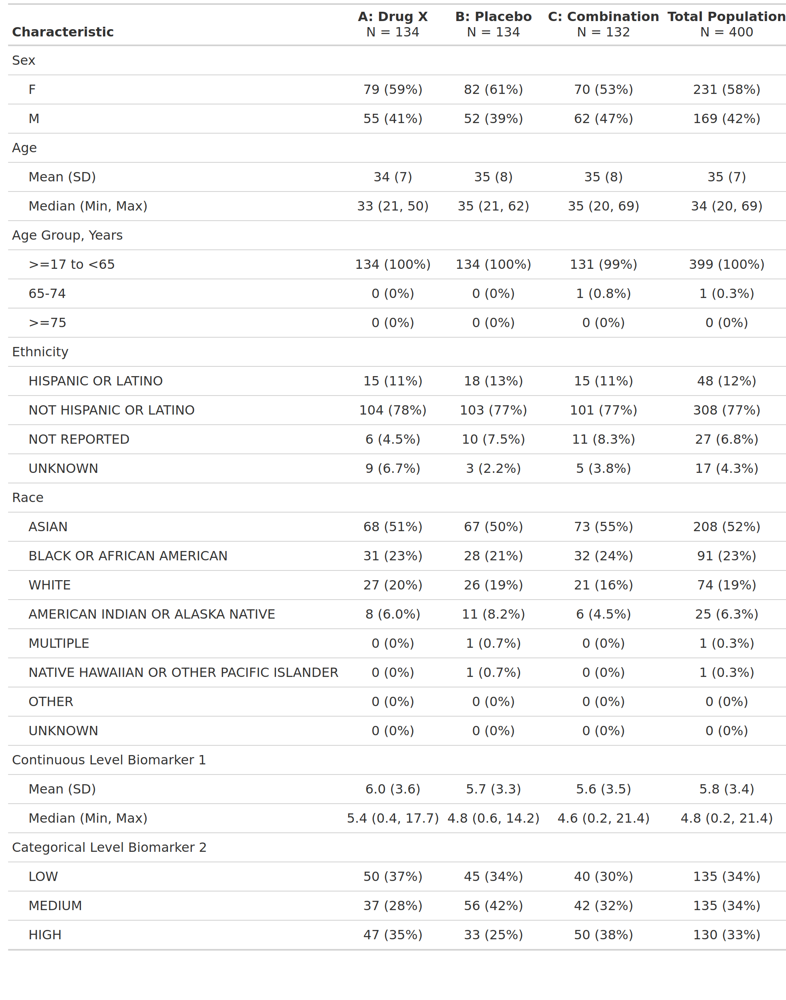

::: panel-tabset
## Table Preview

```{r img, echo=FALSE, fig.align='center', out.width='60%'}

```

## Setup

```{r setup, message=FALSE}
# Load libraries & data -------------------------------------
library(cardinalfda)
library(dplyr)

adsl <- pharmaverseadam::adsl |>
  # removing screen failure observations
  filter(TRT01A != "Screen Failure") |>
  # Adding a numeric biomarker (weight) — include in vars to show in table
  left_join(
    pharmaverseadam::advs |>
      filter(VSTESTCD == "WEIGHT", VISIT == "BASELINE") |>
      select(USUBJID, WEIGHTBL = AVAL),
    by = "USUBJID",
    relationship = "one-to-one"
  )
```

## Build Table

```{r tbl, results='hide'}
result <- make_table_02(
  df = adsl,
  label = list(AGEGR1 = "Age Group, Years")
)

result$table
```

```{r eval=FALSE, include=FALSE}
# Run chunk locally to generate image file
gt::gtsave(gtsummary::as_gt(result$table), filename = "result.png")
```

```{r img, echo=FALSE, fig.align='center', out.width='60%'}
```

## Build ARD

```{r ard, message=FALSE, warning=FALSE}
result$ard
```

```{r, echo=FALSE}
# Print full ARD
withr::local_options(width = 9999)
print(result$ard, columns = "all")
```
:::
