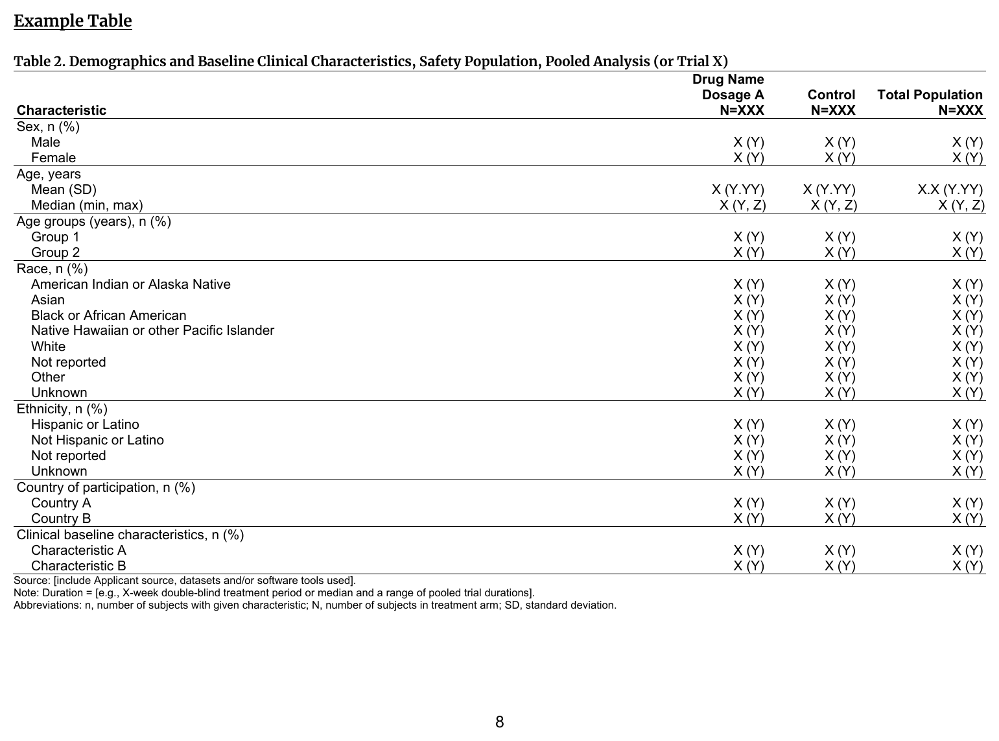
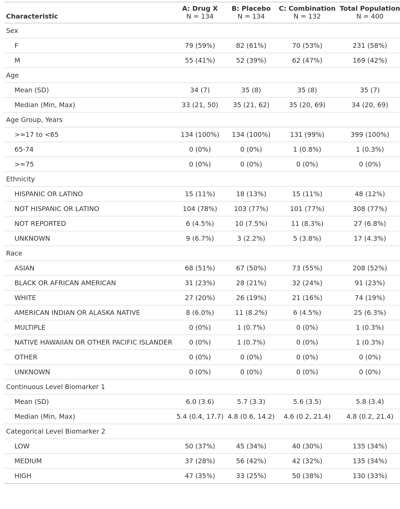

::::: columns

:::: {.column width="52%"}
### FDA IG Shell

{fig-alt="FDA IG example table shell" .lightbox width=100%}

### Programming Notes

**Background and Instructions**

For Table 2: Demographics and Baseline Clinical Characteristics , consider the key baseline characteristics and subpopulations with different disease characteristics that could influence the effectiveness or safety of the drug. The latter may include baseline entry criteria and other specific characteristics that were recorded but not considered as entry criteria, such as duration, stage, or severity of disease; a history of failure on particular treatments; comorbid conditions; use of relevant concomitant medications; risk factors; or baseline laboratory measurements not part of the entry criteria (e.g., LDL cholesterol, C-reactive protein levels, kidney function, or

6 hepatic function) that could affect safety. Depending on the geographic makeup of the trial, the region of participation rather than country may be included.

Table 2 is typically generated for each trial listed in Table 1: Clinical Trials Submitted in Support of Efficacy and Safety. When there is missing data in one of the demographic categories, a row labeled as "Missing" will be included in this table and explanatory footnotes added. The table currently displays placeholder values for the characteristics. These placeholder values will change to reflect the data from the respective clinical trial. Demographic characteristics in this table will reflect the Clinical Data Interchange Standards Consortium (CDISC) controlled terminology when submitted data conforms to CDISC data standards.

**Customization**

In addition to the standard groupings, the clinical reviewer may request custom age groups (e.g., <45, 45 to <65 years, etc.), additional baseline characteristics (e.g., anthropometric measurements such as body mass index [BMI], disease characteristics such as medical history of diabetes) to be displayed as needed. For trials that include older subjects (e.g., Alzheimer's disease trials), additional geriatric age subgroups may be included (e.g., 65 to 74 years of age, 75 to 84 years of age, and 85 years of age and older). Refer to the guidance for industry E7 Studies in Support of Special Populations: Geriatrics, Questions and Answers (March 2012). 7

7 See the FDA guidance for industry and Food and Drug Administration Staff Collection of Race and Ethnicity Data in Clinical Trials (October 2016), available at https://www.fda.gov/regulatory-information/search-fda-guidance-documents/collection-race-and-ethnicity-data-clinical-trials

::::

:::: {.column width="4%"}
::::

:::: {.column width="44%"}
### Output

```{r out-result, echo=FALSE, fig.align='center', out.width='100%'}

```

::::

:::::

::: panel-tabset
## Full Code

```{r fullcode, file="../../../inst/templates/fda-table_02.R", message=FALSE, warning=FALSE, results='hide'}
```

## Table

```{r tbl}
tbl
```

## ARD

```{r ard, message=FALSE, warning=FALSE}
withr::local_options(width = 9999, tibble.print_max = Inf)
print(ard, columns = "all")
```

:::

