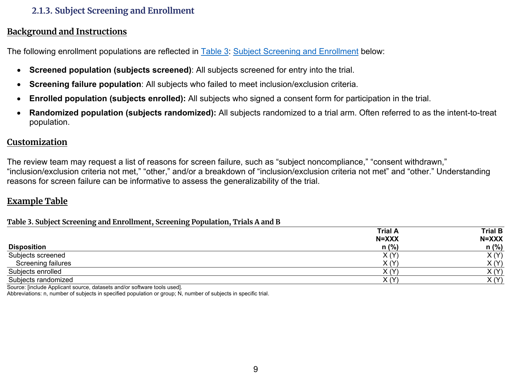
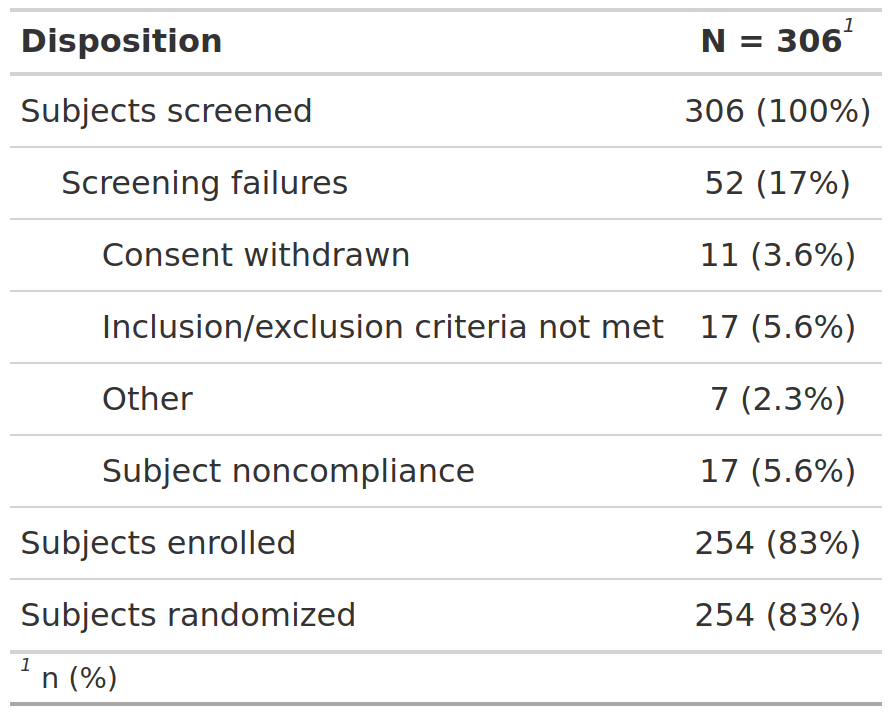

::::: columns

:::: {.column width="52%"}
### FDA IG Shell

{fig-alt="FDA IG example table shell" .lightbox width=100%}

### Programming Notes

**Background and Instructions**

The following enrollment populations are reflected in Table 3: Subject Screening and Enrollment below:

•    Screened population (subjects screened): All subjects screened for entry into the trial.

•    Screening failure population: All subjects who failed to meet inclusion/exclusion criteria.

•    Enrolled population (subjects enrolled): All subjects who signed a consent form for participation in the trial.

•    Randomized population (subjects randomized): All subjects randomized to a trial arm. Often referred to as the intent-to-treat

population.

**Customization**

The review team may request a list of reasons for screen failure, such as "subject noncompliance," "consent withdrawn," "inclusion/exclusion criteria not met," "other," and/or a breakdown of "inclusion/exclusion criteria not met" and "other." Understanding reasons for screen failure can be informative to assess the generalizability of the trial.

::::

:::: {.column width="4%"}
::::

:::: {.column width="44%"}
### Output

```{r out-result, echo=FALSE, fig.align='center', out.width='100%'}

```

::::

:::::

::: panel-tabset
## Full Code

```{r fullcode, file="../../../inst/templates/fda-table_03.R", message=FALSE, warning=FALSE, results='hide'}
```

## Table

```{r tbl}
tbl
```

## ARD

```{r ard, message=FALSE, warning=FALSE}
withr::local_options(width = 9999, tibble.print_max = Inf)
print(ard, columns = "all")
```

:::

