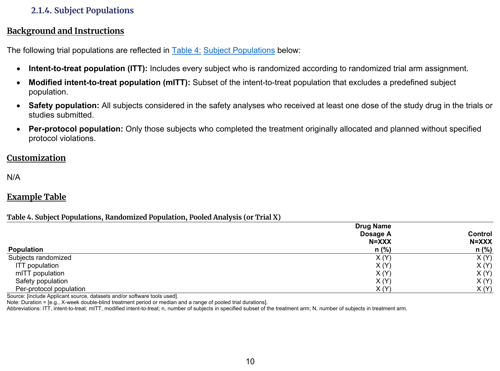
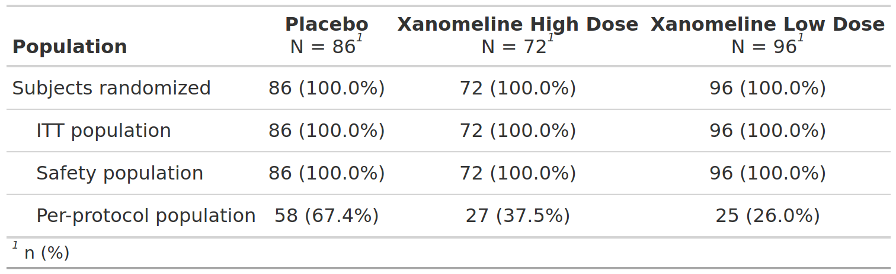

::::: columns

:::: {.column width="52%"}
### FDA IG Shell

{fig-alt="FDA IG example table shell" .lightbox width=100%}

### Programming Notes

**Background and Instructions**

The following trial populations are reflected in Table 4: Subject Populations below:

•    Intent-to-treat population (ITT): Includes every subject who is randomized according to randomized trial arm assignment.

•    Modified intent-to-treat population (mITT): Subset of the intent-to-treat population that excludes a predefined subject population.

•    Safety population: All subjects considered in the safety analyses who received at least one dose of the study drug in the trials or studies submitted.

•    Per-protocol population: Only those subjects who completed the treatment originally allocated and planned without specified protocol violations.

**Customization**

[N/A (per FDA IG)](https://www.fda.gov/media/187065/download)

::::

:::: {.column width="4%"}
::::

:::: {.column width="44%"}
### Output

```{r out-result, echo=FALSE, fig.align='center', out.width='100%'}

```

::::

:::::

::: panel-tabset
## Full Code

```{r fullcode, file="../../../inst/templates/fda-table_04.R", message=FALSE, warning=FALSE, results='hide'}
```

## Table

```{r tbl}
tbl
```

## ARD

```{r ard, message=FALSE, warning=FALSE}
withr::local_options(width = 9999, tibble.print_max = Inf)
print(ard, columns = "all")
```

:::

