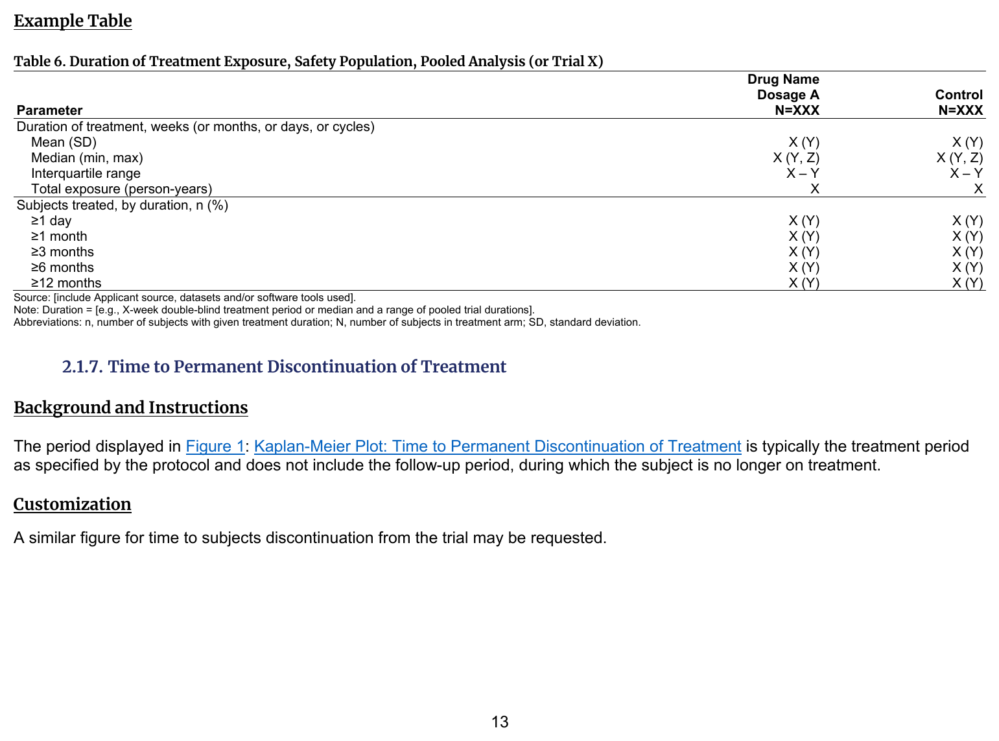
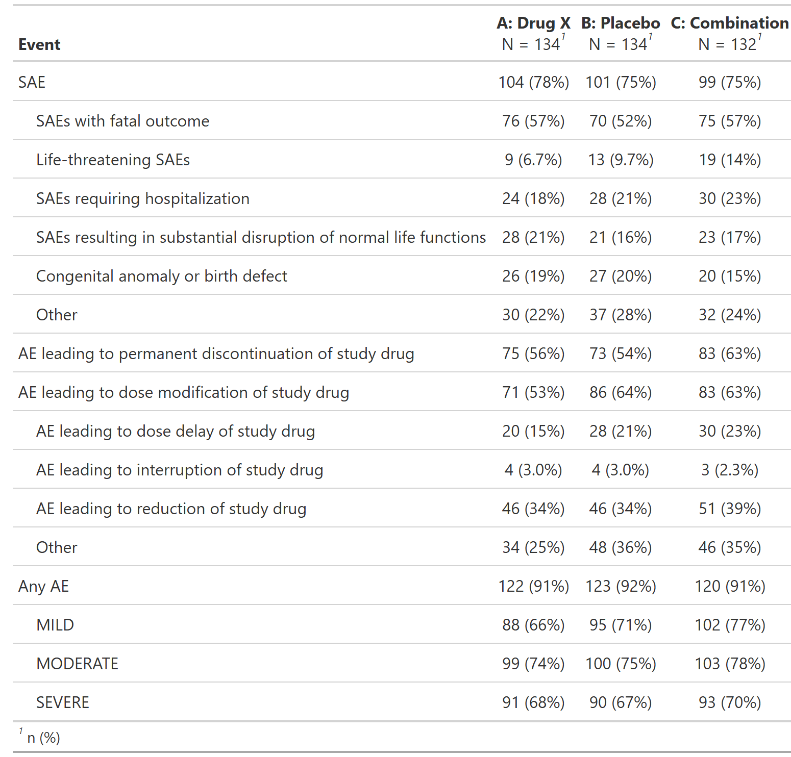

::::: columns

:::: {.column width="52%"}
### FDA IG Shell

{fig-alt="FDA IG example table shell" .lightbox width=100%}

### Programming Notes

**Background and Instructions**

[N/A (per FDA IG)](https://www.fda.gov/media/187065/download)

**Customization**

Discuss appropriate time points for duration of treatment with the CDS. Consider adding metrics such as dose intensity and relative dose intensity as appropriate (e.g., for oncology trials or studies):

•   Dose intensity is the total amount of drug given in a fixed unit of time (usually 1 week), and thus is a function of dose and frequency of administration.

•   Relative dose intensity is the ratio of "delivered" to the "planned" dose intensity and can be expressed as a percentage. A relative dose intensity of 100% indicates that the drug was administered at the dose planned per protocol, without delay, and without cancellations.

::::

:::: {.column width="4%"}
::::

:::: {.column width="44%"}
### Output

```{r out-result, echo=FALSE, fig.align='center', out.width='100%'}

```

::::

:::::

::: panel-tabset
## Full Code

```{r fullcode, file="../../../inst/templates/fda-table_06.R", message=FALSE, warning=FALSE, results='hide'}
```

## Table

```{r tbl}
tbl
```

## ARD

```{r ard, message=FALSE, warning=FALSE}
withr::local_options(width = 9999, tibble.print_max = Inf)
print(ard, columns = "all")
```

:::

