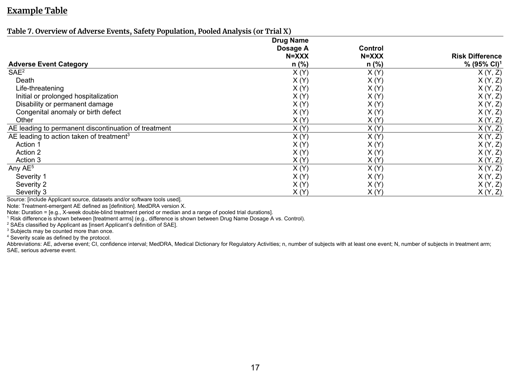

::::: columns

:::: {.column width="52%"}
### FDA IG Shell

{fig-alt="FDA IG example table shell" .lightbox width=100%}

### Programming Notes

**Background and Instructions**

Table 7: Overview of Adverse Events summarizes AEs and includes incidence of SAEs based on individual components of the SAE criteria. The event values listed in this example table are placeholders that reflect CDISC controlled terminology. The values will be replaced by those found in the clinical trial data. When CDISC controlled terminology is used in the clinical trial data, the events shown in this table will reflect the controlled terminology.

**Customization**

Clinical reviewers may discuss with CDS if they would like to designate additional AEs as "Serious" and include them in the "Other" category in the table. These additional AEs may include important medical events that do not result in death, are not life-threatening, and do not require hospitalization but that jeopardize the subject and require medical or surgical intervention to prevent one of these outcomes.

::::

:::: {.column width="4%"}
::::

:::: {.column width="44%"}
### Output

```{r out-result, echo=FALSE, fig.align='center', out.width='100%'}
knitr::include_graphics("result.png")
```

::::

:::::

::: panel-tabset
## Full Code

```{r fullcode, file="../../../inst/templates/fda-table_07.R", message=FALSE, warning=FALSE, results='hide'}
```

## Table

```{r tbl}
tbl
```

## ARD

```{r ard, message=FALSE, warning=FALSE}
withr::local_options(width = 9999, tibble.print_max = Inf)
print(ard, columns = "all")
```

:::

