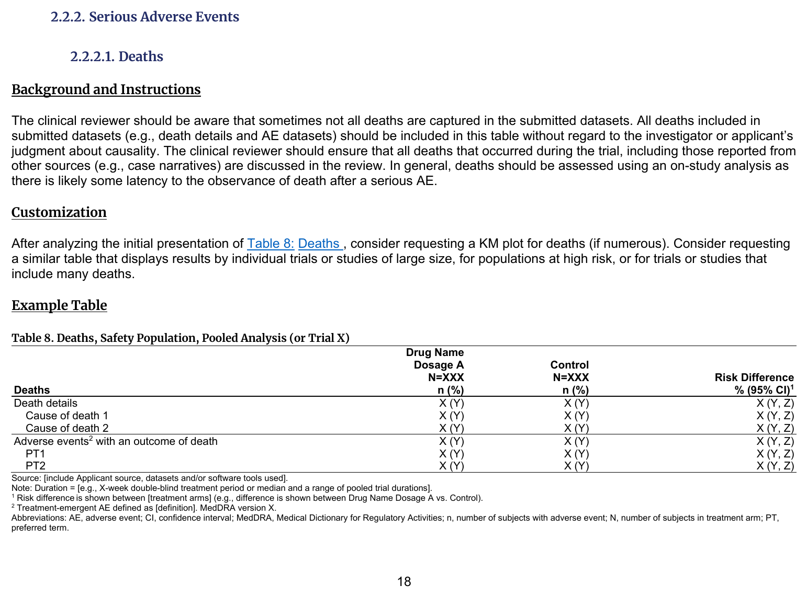
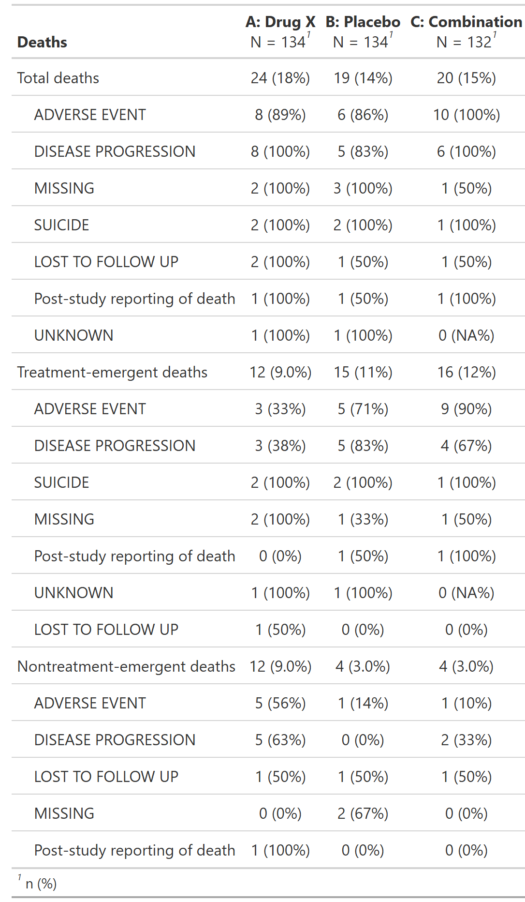

::::: columns

:::: {.column width="52%"}
### FDA IG Shell

{fig-alt="FDA IG example table shell" .lightbox width=100%}

### Programming Notes

**Background and Instructions**

The clinical reviewer should be aware that sometimes not all deaths are captured in the submitted datasets. All deaths included in submitted datasets (e.g., death details and AE datasets) should be included in this table without regard to the investigator or applicant's judgment about causality. The clinical reviewer should ensure that all deaths that occurred during the trial, including those reported from other sources (e.g., case narratives) are discussed in the review. In general, deaths should be assessed using an on-study analysis as there is likely some latency to the observance of death after a serious AE.

**Customization**

After analyzing the initial presentation of Table 8: Deaths , consider requesting a KM plot for deaths (if numerous). Consider requesting a similar table that displays results by individual trials or studies of large size, for populations at high risk, or for trials or studies that include many deaths.

::::

:::: {.column width="4%"}
::::

:::: {.column width="44%"}
### Output

```{r out-result, echo=FALSE, fig.align='center', out.width='100%'}

```

::::

:::::

::: panel-tabset
## Full Code

```{r fullcode, eval=FALSE}
# Load libraries & data -------------------------------------
library(dplyr)
library(cards)
library(gtsummary)

adsl <- pharmaverseadam::adsl
adae <- pharmaverseadam::adae

# Pre-processing --------------------------------------------
adsl <- adsl |>
  filter(SAFFL == "Y") # safety population

data <- adae |>
  filter(
    # safety population
    SAFFL == "Y",
    # deaths
    DTHFL == "Y"
  )

tbl_dthcaus <- data |>
  tbl_hierarchical(
    variables = DTHCAUS,
    id = USUBJID,
    by = TRT01A,
    denominator = adsl,
    overall_row = TRUE,
    label = list("..ard_hierarchical_overall.." = "Death details", DTHCAUS = "**Deaths**")
  ) |>
  sort_hierarchical() |>
  modify_indent(columns = label, rows = variable == "DTHCAUS", indent = 4L)

tbl_aesdth <- data |>
  filter(AESDTH == "Y") |>
  tbl_hierarchical(
    variables = AEDECOD,
    id = USUBJID,
    by = TRT01A,
    denominator = adsl,
    overall_row = TRUE,
    label = list("..ard_hierarchical_overall.." = "Adverse events with an outcome of death", AEDECOD = "**Deaths**")
  ) |>
  sort_hierarchical() |>
  modify_indent(columns = label, rows = variable == "AEDECOD", indent = 4L)

tbl <- tbl_stack(list(tbl_dthcaus, tbl_aesdth))

ard <- gather_ard(tbl)

# Print ARD
withr::local_options(width = 9999)
print(ard)
```

## Setup

```{r setup, message=FALSE}
# Load libraries & data -------------------------------------
library(dplyr)
library(cards)
library(gtsummary)

adsl <- pharmaverseadam::adsl
adae <- pharmaverseadam::adae

# Pre-processing --------------------------------------------
adsl <- adsl |>
  filter(SAFFL == "Y") # safety population

data <- adae |>
  filter(
    # safety population
    SAFFL == "Y",
    # deaths
    DTHFL == "Y"
  )
```

## Build Table

```{r tbl, results = 'hide'}
tbl_dthcaus <- data |>
  tbl_hierarchical(
    variables = DTHCAUS,
    id = USUBJID,
    by = TRT01A,
    denominator = adsl,
    overall_row = TRUE,
    label = list("..ard_hierarchical_overall.." = "Death details", DTHCAUS = "**Deaths**")
  ) |>
  sort_hierarchical() |>
  modify_indent(columns = label, rows = variable == "DTHCAUS", indent = 4L)

tbl_aesdth <- data |>
  filter(AESDTH == "Y") |>
  tbl_hierarchical(
    variables = AEDECOD,
    id = USUBJID,
    by = TRT01A,
    denominator = adsl,
    overall_row = TRUE,
    label = list("..ard_hierarchical_overall.." = "Adverse events with an outcome of death", AEDECOD = "**Deaths**")
  ) |>
  sort_hierarchical() |>
  modify_indent(columns = label, rows = variable == "AEDECOD", indent = 4L)

tbl <- tbl_stack(list(tbl_dthcaus, tbl_aesdth))

tbl
```

## Build ARD

```{r ard, message=FALSE, warning=FALSE, results='hide'}
ard <- gather_ard(tbl)
ard
```

```{r, echo=FALSE}
# Print ARD
withr::local_options(width = 9999)
print(ard)
```

:::
