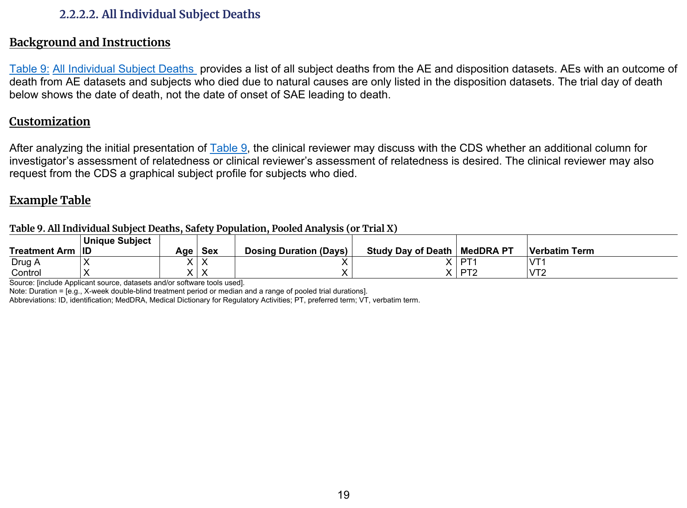
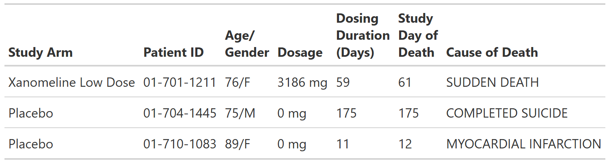

::::: columns

:::: {.column width="52%"}
### FDA IG Shell

{fig-alt="FDA IG example table shell" .lightbox width=100%}

### Programming Notes

**Background and Instructions**

Table 9: All Individual Subject Deaths provides a list of all subject deaths from the AE and disposition datasets. AEs with an outcome of death from AE datasets and subjects who died due to natural causes are only listed in the disposition datasets. The trial day of death below shows the date of death, not the date of onset of SAE leading to death.

**Customization**

After analyzing the initial presentation of Table 9, the clinical reviewer may discuss with the CDS whether an additional column for investigator's assessment of relatedness or clinical reviewer's assessment of relatedness is desired. The clinical reviewer may also request from the CDS a graphical subject profile for subjects who died.

::::

:::: {.column width="4%"}
::::

:::: {.column width="44%"}
### Output

```{r out-result, echo=FALSE, fig.align='center', out.width='100%'}

```

::::

:::::

::: panel-tabset
## Full Code

```{r fullcode, eval=FALSE}
# Load libraries & data -------------------------------------
library(dplyr)
library(cards)
library(gtsummary)

adae <- pharmaverseadam::adae
adex <- pharmaverseadam::adex

# Pre-processing --------------------------------------------
# deaths
adae <- adae |>
  filter(
    # safety population
    SAFFL == "Y",
    # deaths
    DTHFL == "Y"
  ) |>
  # select variables from `adae` to include in final result
  select(USUBJID, TRT01A, AGE, SEX, DTHADY, DTHCAUS) |>
  # keep one row per unique ID
  distinct(USUBJID, DTHCAUS, DTHADY, .keep_all = TRUE)

# dosing
adex <- adex |>
  filter(
    # safety population
    SAFFL == "Y",
    # total dosages
    PARAMCD == "TDOSE"
  ) |>
  # select variables from `adex` to include in final result
  select(USUBJID, AVAL, TRTSDT, TRTEDT) |>
  mutate(
    # derive dosage duration
    DOSDUR = (TRTEDT - TRTSDT + 1) |> as.character()
  )

# combine all data
data <- left_join(adae, adex, by = "USUBJID") |>
  select(TRT01A, USUBJID, AGE, SEX, DOSDUR, DTHADY, DTHCAUS) |>
  arrange()

tbl <- as_gtsummary(data) |>
  # set table header labels
  modify_header(
    TRT01A = "**Treatment Arm**",
    USUBJID = "**Unique  \n Subject ID**",
    AGE = "**Age**",
    SEX = "**Sex**",
    DOSDUR = "**Dosing**  \n **Duration**  \n **(Days)**",
    DTHADY = "**Study**  \n **Day of**  \n **Death**",
    DTHCAUS = "**Cause of Death**"
  ) |>
  # align all columns left
  modify_column_alignment(everything(), align = "left")

# For this table we do not build an ARD since we are returning the complete
# dataset as our result, so there are no statistics to display in an ARD.
# The full unformatted dataset (`data`) can be used instead if needed
data

# Print data
withr::local_options(width = 9999)
print(data, columns = "all", n = 40)
```

## Setup

```{r setup, message=FALSE}
# Load libraries & data -------------------------------------
library(dplyr)
library(cards)
library(gtsummary)

adae <- pharmaverseadam::adae
adex <- pharmaverseadam::adex

# Pre-processing --------------------------------------------
# deaths
adae <- adae |>
  filter(
    # safety population
    SAFFL == "Y",
    # deaths
    DTHFL == "Y"
  ) |>
  # select variables from `adae` to include in final result
  select(USUBJID, TRT01A, AGE, SEX, DTHADY, DTHCAUS) |>
  # keep one row per unique ID
  distinct(USUBJID, DTHCAUS, DTHADY, .keep_all = TRUE)

# dosing
adex <- adex |>
  filter(
    # safety population
    SAFFL == "Y",
    # total dosages
    PARAMCD == "TDOSE"
  ) |>
  # select variables from `adex` to include in final result
  select(USUBJID, AVAL, TRTSDT, TRTEDT) |>
  mutate(
    # derive dosage duration
    DOSDUR = (TRTEDT - TRTSDT + 1) |> as.character()
  )

# combine all data
data <- left_join(adae, adex, by = "USUBJID") |>
  select(TRT01A, USUBJID, AGE, SEX, DOSDUR, DTHADY, DTHCAUS) |>
  arrange()
```

## Build Table

```{r tbl, results = 'hide'}
tbl <- as_gtsummary(data) |>
  # set table header labels
  modify_header(
    TRT01A = "**Treatment Arm**",
    USUBJID = "**Unique  \n Subject ID**",
    AGE = "**Age**",
    SEX = "**Sex**",
    DOSDUR = "**Dosing**  \n **Duration**  \n **(Days)**",
    DTHADY = "**Study**  \n **Day of**  \n **Death**",
    DTHCAUS = "**Cause of Death**"
  ) |>
  # align all columns left
  modify_column_alignment(everything(), align = "left")

tbl
```

## Build ARD

```{r ard, message=FALSE, warning=FALSE, results='hide'}
# For this table we do not build an ARD since we are returning the complete
# dataset as our result, so there are no statistics to display in an ARD.
# The full unformatted dataset (`data`) can be used instead if needed
data
```

```{r, echo=FALSE}
# Print data
withr::local_options(width = 9999)
print(data, columns = "all", n = 40)
```

:::
