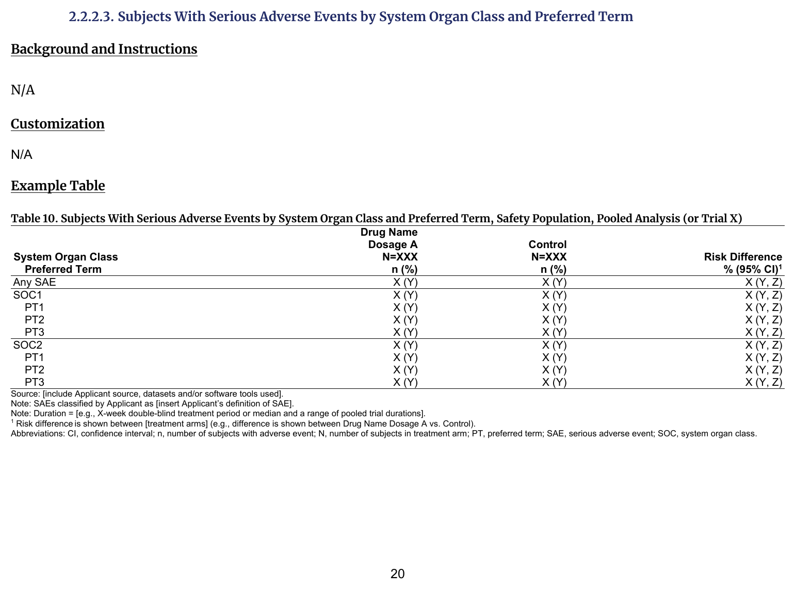
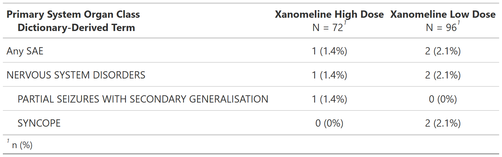

::::: columns

:::: {.column width="52%"}
### FDA IG Shell

{fig-alt="FDA IG example table shell" .lightbox width=100%}

### Programming Notes

**Background and Instructions**

N/A (per FDA IG)

**Customization**

N/A (per FDA IG)

::::

:::: {.column width="4%"}
::::

:::: {.column width="44%"}
### Output

```{r out-result, echo=FALSE, fig.align='center', out.width='100%'}

```

::::

:::::

::: panel-tabset
## Full Code

```{r fullcode, eval=FALSE}
# Load libraries & data -------------------------------------
library(dplyr)
library(gtsummary)

adsl <- pharmaverseadam::adsl
adae <- pharmaverseadam::adae

# Pre-processing --------------------------------------------
adae <- adae |>
  filter(
    # safety population
    SAFFL == "Y",
    # serious adverse events
    AESER == "Y"
  )

tbl <- adae |>
  tbl_hierarchical(
    variables = c(AESOC, AEDECOD),
    by = TRT01A,
    id = USUBJID,
    denominator = adsl,
    overall_row = TRUE,
    label = "..ard_hierarchical_overall.." ~ "Any SAE"
  )

ard <- gather_ard(tbl)
```

## Setup

```{r setup, message=FALSE}
# Load libraries & data -------------------------------------
library(dplyr)
library(gtsummary)

adsl <- pharmaverseadam::adsl
adae <- pharmaverseadam::adae

# Pre-processing --------------------------------------------
adae <- adae |>
  filter(
    # safety population
    SAFFL == "Y",
    # serious adverse events
    AESER == "Y"
  )
```

## Build Table

```{r tbl, results='hide'}
tbl <- adae |>
  tbl_hierarchical(
    variables = c(AESOC, AEDECOD),
    by = TRT01A,
    id = USUBJID,
    denominator = adsl,
    overall_row = TRUE,
    label = "..ard_hierarchical_overall.." ~ "Any SAE"
  )

tbl
```

## Build ARD

```{r ard, message=FALSE, warning=FALSE, results='hide'}
ard <- gather_ard(tbl)
ard
```

```{r, echo=FALSE}
# Print full ARD
withr::local_options(width = 9999)
print(ard, columns = "all")
```

:::
