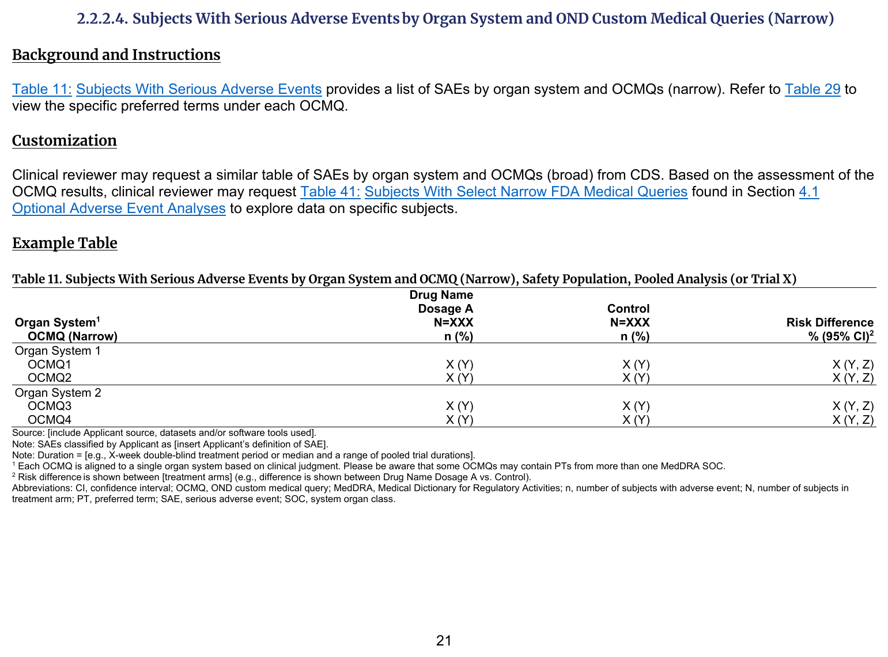
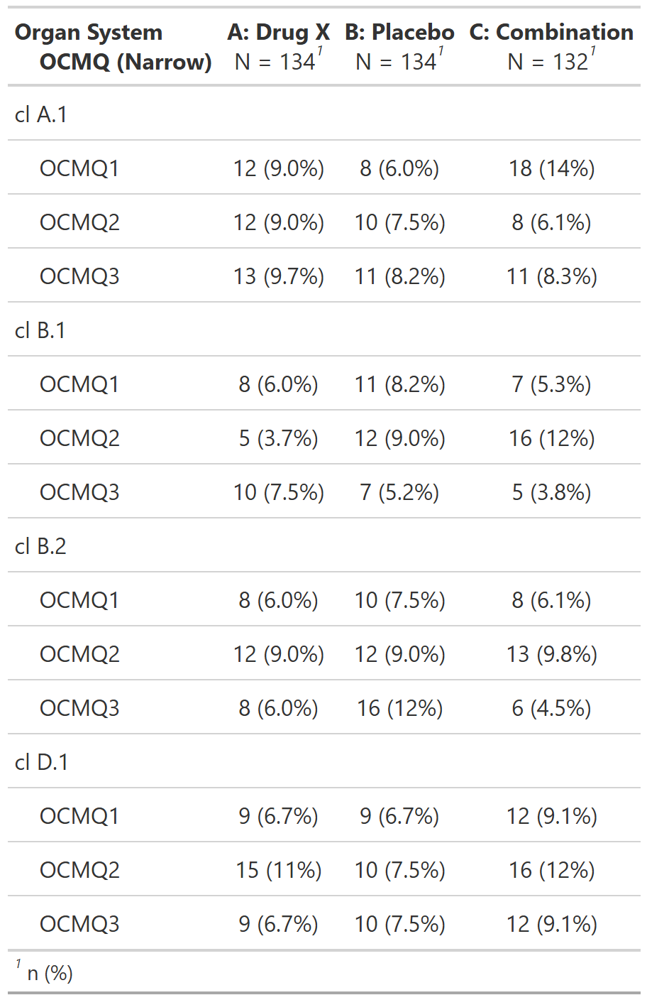

::::: columns

:::: {.column width="52%"}
### FDA IG Shell

{fig-alt="FDA IG example table shell" .lightbox width=100%}

### Programming Notes

**Background and Instructions**

Table 11: Subjects With Serious Adverse Events provides a list of SAEs by organ system and OCMQs (narrow). Refer to Table 29 to view the specific preferred terms under each OCMQ.

**Customization**

Clinical reviewer may request a similar table of SAEs by organ system and OCMQs (broad) from CDS. Based on the assessment of the OCMQ results, clinical reviewer may request Table 41: Subjects With Select Narrow FDA Medical Queries found in Section 4.1 Optional Adverse Event Analyses to explore data on specific subjects.

::::

:::: {.column width="4%"}
::::

:::: {.column width="44%"}
### Output

```{r out-result, echo=FALSE, fig.align='center', out.width='100%'}

```

::::

:::::

::: panel-tabset
## Full Code

```{r fullcode, eval=FALSE}
# Load libraries & data -------------------------------------
library(dplyr)
library(cards)
library(gtsummary)

adsl <- pharmaverseadam::adsl
adae <- pharmaverseadam::adae

# Pre-Processing - OCMQ information
set.seed(1)
adae <- adae |>
  mutate(
    OCMQ01SC = sample(c("NARROW", "BROAD"), size = nrow(adae), replace = TRUE),
    OCMQ01NAM = sample(c("OCMQ1", "OCMQ2", "OCMQ3"), size = nrow(adae), replace = TRUE),
    AE_serious = sample(c("Y", "N"), size = nrow(adae), replace = TRUE)
  )
# Use safety population, Serious Adverse Event only and Narrow OCMQ
data <- adae |>
  filter(SAFFL == "Y", AE_serious == "Y", OCMQ01SC == "NARROW")

sliced_data <- data |>
  count(AEBODSYS, sort = TRUE) |>
  slice_head(n = 3) %>% # keep top 3 for display purposes
  pull(AEBODSYS)

data <- data |>
  filter(AEBODSYS %in% sliced_data)

# Stack ARD results of two analyses
ard <- ard_stack_hierarchical(
  data,
  variables = c(AEBODSYS, OCMQ01NAM),
  by = TRT01A,
  denominator = adsl,
  id = USUBJID
)

# Print ARD
withr::local_options(width = 9999)
print(ard, columns = "all", n = 40)

tbl <- data |>
  tbl_hierarchical(
    variables = c(AEBODSYS, OCMQ01NAM),
    by = TRT01A,
    id = USUBJID,
    include = OCMQ01NAM,
    denominator = adsl,
    overall_row = FALSE,
    label = list(
      AEBODSYS = "**Organ System**",
      OCMQ01NAM = "**OCMQ (Narrow)**"
    )
  )
```

## Setup

```{r setup, message=FALSE}
# Load libraries & data -------------------------------------
library(dplyr)
library(cards)
library(gtsummary)

adsl <- pharmaverseadam::adsl
adae <- pharmaverseadam::adae

# Pre-Processing - OCMQ information
set.seed(1)
adae <- adae |>
  mutate(
    OCMQ01SC = sample(c("NARROW", "BROAD"), size = nrow(adae), replace = TRUE),
    OCMQ01NAM = sample(c("OCMQ1", "OCMQ2", "OCMQ3"), size = nrow(adae), replace = TRUE),
    AE_serious = sample(c("Y", "N"), size = nrow(adae), replace = TRUE)
  )
# Use safety population, Serious Adverse Event only and Narrow OCMQ
data <- adae |>
  filter(SAFFL == "Y", AE_serious == "Y", OCMQ01SC == "NARROW")

sliced_data <- data |>
  count(AEBODSYS, sort = TRUE) |>
  slice_head(n = 3) %>% # keep top 3 for display purposes
  pull(AEBODSYS)

data <- data |>
  filter(AEBODSYS %in% sliced_data)
```

## Build ARD

```{r ard, message=FALSE, warning=FALSE, results='hide'}
# Stack ARD results of two analyses
ard <- ard_stack_hierarchical(
  data,
  variables = c(AEBODSYS, OCMQ01NAM),
  by = TRT01A,
  denominator = adsl,
  id = USUBJID
)

ard
```

```{r, echo=FALSE}
# Print ARD
withr::local_options(width = 9999)
print(ard, columns = "all", n = 40)
```

## Build Table

```{r tbl, results = 'hide'}
tbl <- data |>
  tbl_hierarchical(
    variables = c(AEBODSYS, OCMQ01NAM),
    by = TRT01A,
    id = USUBJID,
    include = OCMQ01NAM,
    denominator = adsl,
    overall_row = FALSE,
    label = list(
      AEBODSYS = "**Organ System**",
      OCMQ01NAM = "**OCMQ (Narrow)**"
    )
  )

tbl
```

:::
