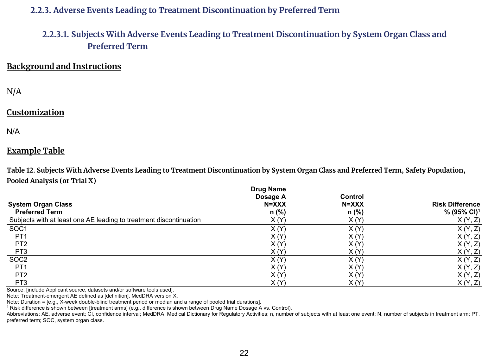
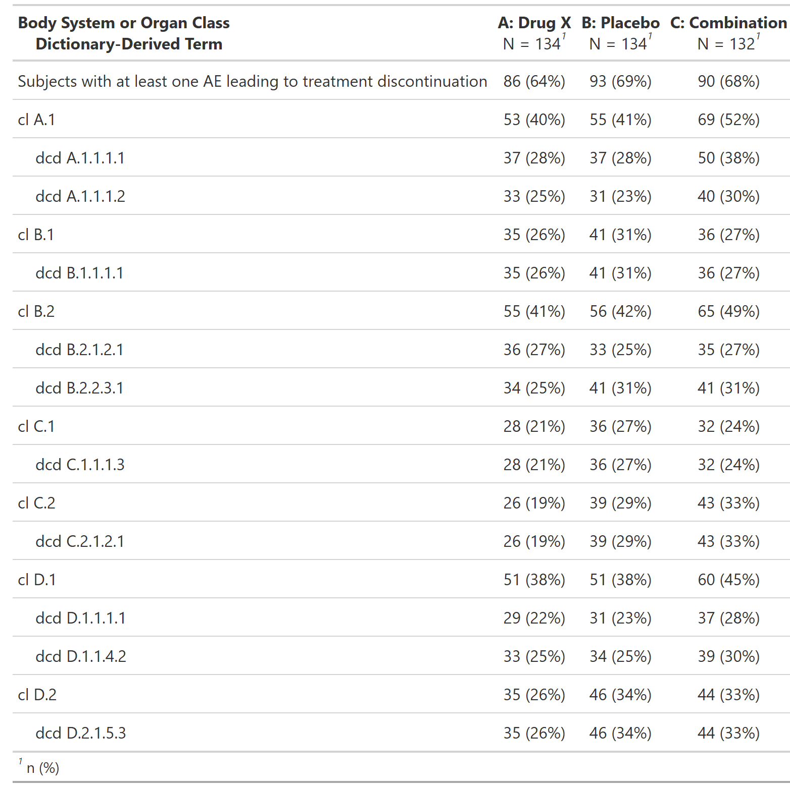

::::: columns

:::: {.column width="52%"}
### FDA IG Shell

{fig-alt="FDA IG example table shell" .lightbox width=100%}

### Programming Notes

**Background and Instructions**

N/A (per FDA IG)

**Customization**

N/A (per FDA IG)

::::

:::: {.column width="4%"}
::::

:::: {.column width="44%"}
### Output

```{r out-result, echo=FALSE, fig.align='center', out.width='100%'}

```

::::

:::::

::: panel-tabset
## Full Code

```{r fullcode, eval=FALSE}
# Load libraries & data -------------------------------------
library(dplyr)
library(cards)
library(gtsummary)

adsl <- random.cdisc.data::cadsl
adae <- random.cdisc.data::cadae
adae$DCSREAS[is.na(adae$DCSREAS)] <- "ADVERSE EVENT"

# Pre-processing --------------------------------------------
adsl <- adsl |>
  filter(SAFFL == "Y") # safety population

data <- adae |>
  filter(
    # safety population
    SAFFL == "Y",
    # discontinuation due to AE
    DCSREAS == "ADVERSE EVENT"
  )

ard <- ard_stack_hierarchical(
  data,
  variables = c(AEBODSYS, AEDECOD),
  by = TRT01A,
  denominator = adsl,
  id = USUBJID
)

# Print ARD
withr::local_options(width = 9999)
print(ard, columns = "all", n = 40)

tbl <- tbl_hierarchical(
  data,
  variables = c(AEBODSYS, AEDECOD),
  by = TRT01A,
  id = USUBJID,
  denominator = adsl,
  overall_row = TRUE,
  label = list(..ard_hierarchical_overall.. = "Subjects with at least one AE leading to treatment discontinuation")
)
```

## Setup

```{r setup, message=FALSE}
# Load libraries & data -------------------------------------
library(dplyr)
library(cards)
library(gtsummary)

adsl <- random.cdisc.data::cadsl
adae <- random.cdisc.data::cadae
adae$DCSREAS[is.na(adae$DCSREAS)] <- "ADVERSE EVENT"

# Pre-processing --------------------------------------------
adsl <- adsl |>
  filter(SAFFL == "Y") # safety population

data <- adae |>
  filter(
    # safety population
    SAFFL == "Y",
    # discontinuation due to AE
    DCSREAS == "ADVERSE EVENT"
  )
```

## Build ARD

```{r ard, message=FALSE, warning=FALSE, results='hide'}
ard <- ard_stack_hierarchical(
  data,
  variables = c(AEBODSYS, AEDECOD),
  by = TRT01A,
  denominator = adsl,
  id = USUBJID
)

ard
```

```{r, echo=FALSE}
# Print ARD
withr::local_options(width = 9999)
print(ard, columns = "all", n = 40)
```

## Build Table

```{r tbl, results = 'hide'}
tbl <- tbl_hierarchical(
  data,
  variables = c(AEBODSYS, AEDECOD),
  by = TRT01A,
  id = USUBJID,
  denominator = adsl,
  overall_row = TRUE,
  label = list(..ard_hierarchical_overall.. = "Subjects with at least one AE leading to treatment discontinuation")
)

tbl
```

:::
