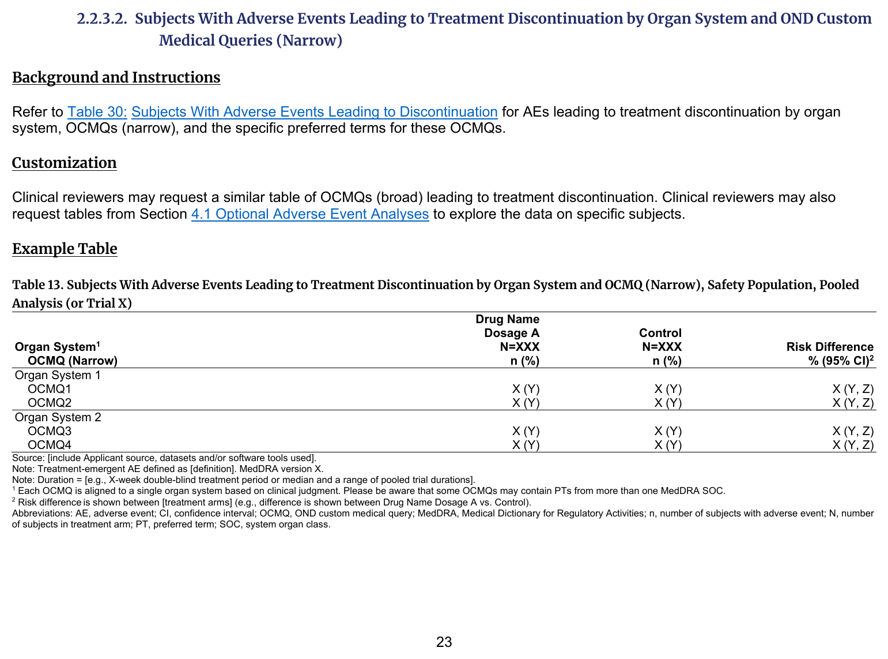
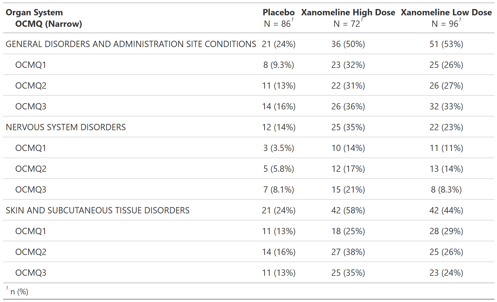

::::: columns

:::: {.column width="52%"}
### FDA IG Shell

{fig-alt="FDA IG example table shell" .lightbox width=100%}

### Programming Notes

**Background and Instructions**

Refer to Table 30: Subjects With Adverse Events Leading to Discontinuation for AEs leading to treatment discontinuation by organ system, OCMQs (narrow), and the specific preferred terms for these OCMQs.

**Customization**

Clinical reviewers may request a similar table of OCMQs (broad) leading to treatment discontinuation. Clinical reviewers may also request tables from Section 4.1 Optional Adverse Event Analyses to explore the data on specific subjects.

::::

:::: {.column width="4%"}
::::

:::: {.column width="44%"}
### Output

```{r out-result, echo=FALSE, fig.align='center', out.width='100%'}

```

::::

:::::

::: panel-tabset
## Full Code

```{r fullcode, eval=FALSE}
# Load libraries & data -------------------------------------
library(dplyr)
library(cards)
library(gtsummary)

set.seed(1)
adsl <- pharmaverseadam::adsl
adae <- pharmaverseadam::adae

adae <- adae |>
  rename(OCMQ01SC = AEHLTCD) |>
  mutate(
    AESER = sample(c("Y", "N"), size = nrow(adae), replace = TRUE),
    OCMQ01NAM = sample(c("OCMQ1", "OCMQ2", "OCMQ3"), size = nrow(adae), replace = TRUE)
  )

adae$OCMQ01SC[is.na(adae$OCMQ01SC)] <- "NARROW"

# Pre-processing --------------------------------------------
adsl <- adsl |>
  filter(SAFFL == "Y") # safety population

data <- adae |>
  filter(
    # safety population
    SAFFL == "Y",
    # narrow OCMQ
    OCMQ01SC == "NARROW"
  )

sliced_data <- data |>
  count(AEBODSYS, sort = TRUE) |>
  slice_head(n = 3) |> # keep top 3
  pull(AEBODSYS)

data <- data |>
  filter(AEBODSYS %in% sliced_data)

ard <- ard_stack_hierarchical(
  data,
  variables = c(AEBODSYS, OCMQ01NAM),
  by = TRT01A,
  denominator = adsl,
  id = USUBJID
)

# Print ARD
withr::local_options(width = 9999)
print(ard, columns = "all", n = 40)

tbl <-
  tbl_hierarchical(
    data,
    variables = c(AEBODSYS, OCMQ01NAM),
    by = TRT01A,
    id = USUBJID,
    denominator = adsl,
    label = list(AEBODSYS = "Organ System", OCMQ01NAM = "OCMQ (Narrow)")
  )
```

## Setup

```{r setup, message=FALSE}
# Load libraries & data -------------------------------------
library(dplyr)
library(cards)
library(gtsummary)

set.seed(1)
adsl <- pharmaverseadam::adsl
adae <- pharmaverseadam::adae

adae <- adae |>
  rename(OCMQ01SC = AEHLTCD) |>
  mutate(
    AESER = sample(c("Y", "N"), size = nrow(adae), replace = TRUE),
    OCMQ01NAM = sample(c("OCMQ1", "OCMQ2", "OCMQ3"), size = nrow(adae), replace = TRUE)
  )

adae$OCMQ01SC[is.na(adae$OCMQ01SC)] <- "NARROW"

# Pre-processing --------------------------------------------
adsl <- adsl |>
  filter(SAFFL == "Y") # safety population

data <- adae |>
  filter(
    # safety population
    SAFFL == "Y",
    # narrow OCMQ
    OCMQ01SC == "NARROW"
  )

sliced_data <- data |>
  count(AEBODSYS, sort = TRUE) |>
  slice_head(n = 3) |> # keep top 3
  pull(AEBODSYS)

data <- data |>
  filter(AEBODSYS %in% sliced_data)
```

## Build ARD

```{r ard, message=FALSE, warning=FALSE, results='hide'}
ard <- ard_stack_hierarchical(
  data,
  variables = c(AEBODSYS, OCMQ01NAM),
  by = TRT01A,
  denominator = adsl,
  id = USUBJID
)

ard
```

```{r, echo=FALSE}
# Print ARD
withr::local_options(width = 9999)
print(ard, columns = "all", n = 40)
```

## Build Table

```{r tbl, results = 'hide'}
tbl <-
  tbl_hierarchical(
    data,
    variables = c(AEBODSYS, OCMQ01NAM),
    by = TRT01A,
    id = USUBJID,
    denominator = adsl,
    label = list(AEBODSYS = "Organ System", OCMQ01NAM = "OCMQ (Narrow)")
  )

tbl
```

:::
