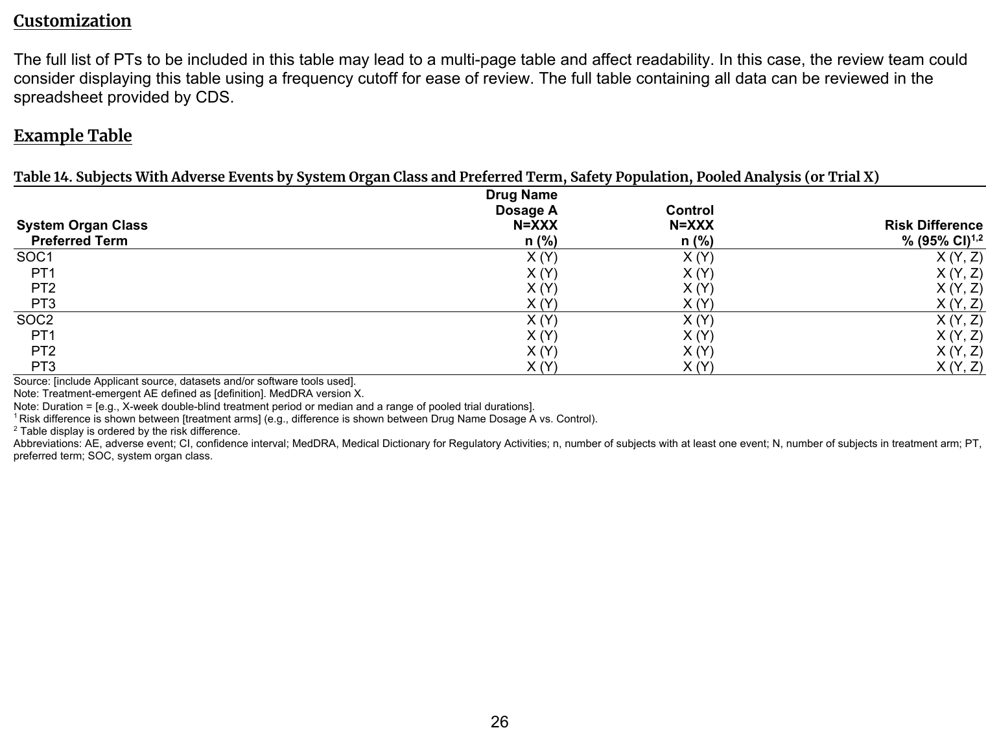
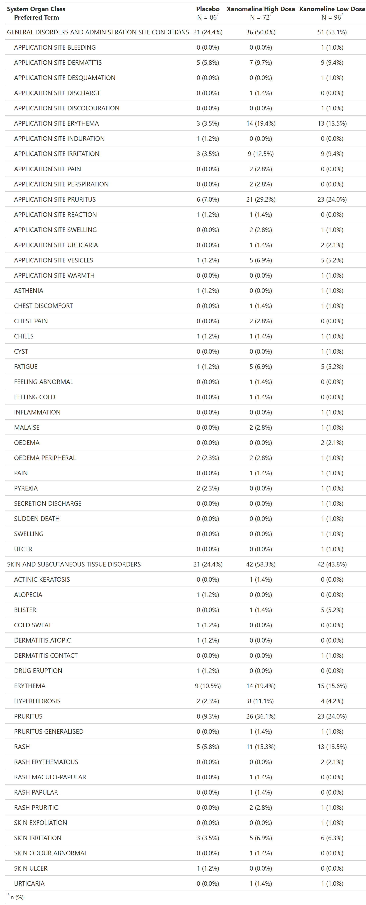

::::: columns

:::: {.column width="52%"}
### FDA IG Shell

{fig-alt="FDA IG example table shell" .lightbox width=100%}

### Programming Notes

**Background and Instructions**

Table 14: Subjects With Adverse Events by System Organ Class and Preferred Term, Safety Population, Pooled Analysis (or Trial X) presents the entire table of AEs by SOC, while Table 15: Subjects With Common Adverse Events shows common AEs by PT. Review of PTs by SOC can elucidate potential imbalances within the same body system that may not be as apparent when looking at individual AEs.

**Customization**

The full list of PTs to be included in this table may lead to a multi-page table and affect readability. In this case, the review team could consider displaying this table using a frequency cutoff for ease of review. The full table containing all data can be reviewed in the spreadsheet provided by CDS.

::::

:::: {.column width="4%"}
::::

:::: {.column width="44%"}
### Output

```{r out-result, echo=FALSE, fig.align='center', out.width='100%'}

```

::::

:::::

::: panel-tabset
## Full Code

```{r fullcode, eval=FALSE}
# Load libraries & data -------------------------------------
library(dplyr)
library(cards)
library(gtsummary)

adsl <- pharmaverseadam::adsl
adae <- pharmaverseadam::adae

# Pre-processing --------------------------------------------
adsl <- adsl |>
  filter(SAFFL == "Y") # safety population

# for display purpose showing only bottom 5 SOCs
sliced_data <- adae |>
  count(AESOC) |>
  slice_min(order_by = n, n = 5) |>
  pull(AESOC)

data <- adae |>
  filter(AESOC %in% sliced_data)

ard <- ard_stack_hierarchical(
  data,
  variables = c(AESOC, AEDECOD),
  by = TRT01A,
  id = USUBJID,
  denominator = adsl
)

# Print ARD
withr::local_options(width = 9999)
print(ard, columns = "all", n = 40)

# create table using ARD-first approach (ARD -> table)
tbl <-
  tbl_ard_hierarchical(
    ard,
    variables = c(AESOC, AEDECOD),
    by = TRT01A,
    # add custom variable labels
    label = list(
      AESOC = "System Organ Class",
      AEDECOD = "Preferred Term"
    )
  )
```

## Setup

```{r setup, message=FALSE}
# Load libraries & data -------------------------------------
library(dplyr)
library(cards)
library(gtsummary)

adsl <- pharmaverseadam::adsl
adae <- pharmaverseadam::adae

# Pre-processing --------------------------------------------
adsl <- adsl |>
  filter(SAFFL == "Y") # safety population

# for display purpose showing only bottom 5 SOCs
sliced_data <- adae |>
  count(AESOC) |>
  slice_min(order_by = n, n = 5) |>
  pull(AESOC)

data <- adae |>
  filter(AESOC %in% sliced_data)
```

## Build ARD

```{r ard, message=FALSE, warning=FALSE, results='hide'}
ard <- ard_stack_hierarchical(
  data,
  variables = c(AESOC, AEDECOD),
  by = TRT01A,
  id = USUBJID,
  denominator = adsl
)

ard
```

```{r, echo=FALSE}
# Print ARD
withr::local_options(width = 9999)
print(ard, columns = "all", n = 40)
```

## Build Table

```{r tbl, results = 'hide'}
# create table using ARD-first approach (ARD -> table)
tbl <-
  tbl_ard_hierarchical(
    ard,
    variables = c(AESOC, AEDECOD),
    by = TRT01A,
    # add custom variable labels
    label = list(
      AESOC = "System Organ Class",
      AEDECOD = "Preferred Term"
    )
  )

tbl
```

:::
