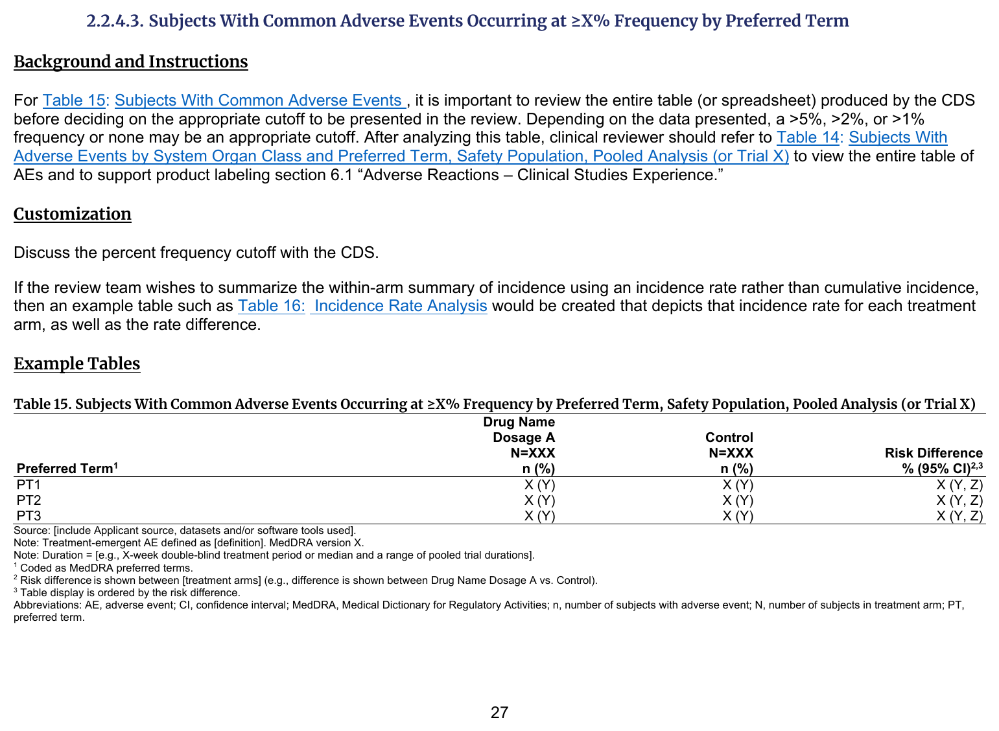
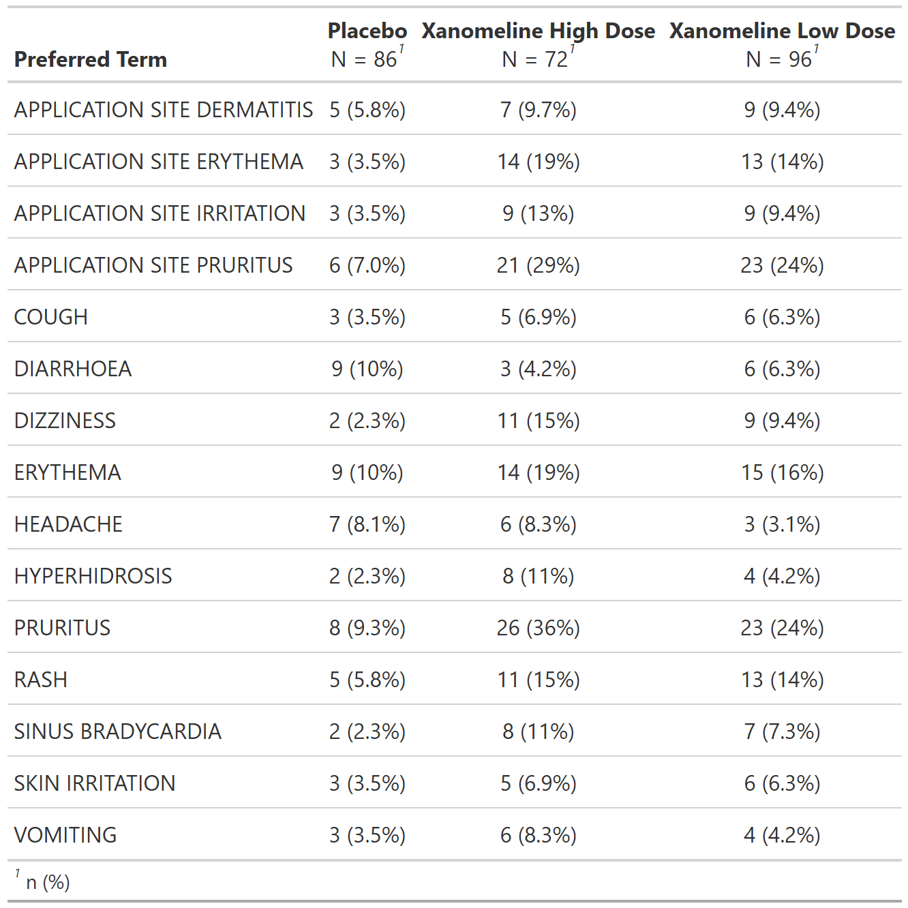

::::: columns

:::: {.column width="52%"}
### FDA IG Shell

{fig-alt="FDA IG example table shell" .lightbox width=100%}

### Programming Notes

**Background and Instructions**

For Table 15: Subjects With Common Adverse Events , it is important to review the entire table (or spreadsheet) produced by the CDS before deciding on the appropriate cutoff to be presented in the review. Depending on the data presented, a >5%, >2%, or >1% frequency or none may be an appropriate cutoff. After analyzing this table, clinical reviewer should refer to Table 14: Subjects With Adverse Events by System Organ Class and Preferred Term, Safety Population, Pooled Analysis (or Trial X) to view the entire table of AEs and to support product labeling section 6.1 "Adverse Reactions - Clinical Studies Experience."

**Customization**

Discuss the percent frequency cutoff with the CDS.

If the review team wishes to summarize the within-arm summary of incidence using an incidence rate rather than cumulative incidence, then an example table such as Table 16: Incidence Rate Analysis would be created that depicts that incidence rate for each treatment arm, as well as the rate difference.

::::

:::: {.column width="4%"}
::::

:::: {.column width="44%"}
### Output

```{r out-result, echo=FALSE, fig.align='center', out.width='100%'}

```

::::

:::::

::: panel-tabset
## Full Code

```{r fullcode, eval=FALSE}
# Load libraries & data -------------------------------------
library(dplyr)
library(cards)
library(gtsummary)

adsl <- pharmaverseadam::adsl
adae <- pharmaverseadam::adae

# Pre-processing --------------------------------------------
adsl <- adsl |>
  filter(SAFFL == "Y") # safety population

data <- adae |>
  filter(
    # safety population
    SAFFL == "Y"
  )

tbl <-
  tbl_hierarchical(
    data,
    variables = c(AEDECOD),
    by = TRT01A,
    id = USUBJID,
    denominator = adsl,
    label = AEDECOD ~ "**Preferred Term**"
  ) |>
  # filter for >=5% frequency
  filter_hierarchical(sum(n) / sum(N) >= 0.05)

ard <- gather_ard(tbl)
```

## Setup

```{r setup, message=FALSE}
# Load libraries & data -------------------------------------
library(dplyr)
library(cards)
library(gtsummary)

adsl <- pharmaverseadam::adsl
adae <- pharmaverseadam::adae

# Pre-processing --------------------------------------------
adsl <- adsl |>
  filter(SAFFL == "Y") # safety population

data <- adae |>
  filter(
    # safety population
    SAFFL == "Y"
  )
```

## Build Table

```{r tbl, results = 'hide'}
tbl <-
  tbl_hierarchical(
    data,
    variables = c(AEDECOD),
    by = TRT01A,
    id = USUBJID,
    denominator = adsl,
    label = AEDECOD ~ "**Preferred Term**"
  ) |>
  # filter for >=5% frequency
  filter_hierarchical(sum(n) / sum(N) >= 0.05)

tbl
```

## Build ARD

```{r ard, message=FALSE, warning=FALSE, results='hide'}
ard <- gather_ard(tbl)
ard
```

```{r, echo=FALSE}
# Print full ARD
withr::local_options(width = 9999)
print(ard, columns = "all")
```

:::
