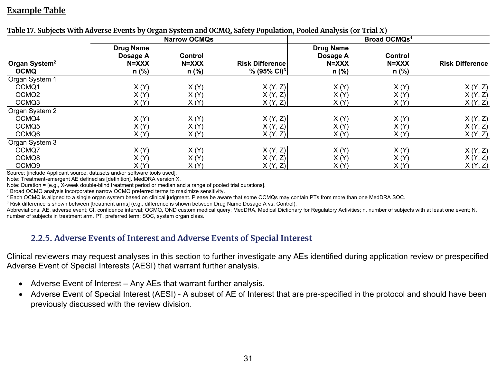
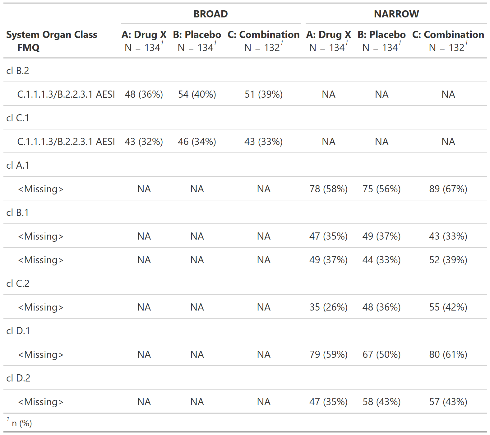

::::: columns

:::: {.column width="52%"}
### FDA IG Shell

{fig-alt="FDA IG example table shell" .lightbox width=100%}

### Programming Notes

**Background and Instructions**

For Table 17: Subjects With Adverse Events by Organ System , it is important to review the entire table (or spreadsheet) produced by the CDS before deciding on the appropriate cutoff to be presented in the review. Depending on the data presented, a >5%, >2%, or >1% frequency or none may be an appropriate cutoff. Refer to Table 31 Subjects With Adverse Events by Organ System, OCMQ (Narrow) and Preferred Term, Safety Population, Pooled Analysis (or Trial X) to view specific preferred terms under each narrow OCMQ by organ system.

**Customization**

After analyzing, clinical reviewers may request to view specific preferred terms under each broad OCMQ by organ system. Based on the assessment of the OCMQ results, clinical reviewers may request Table 41: Subjects With Select Narrow FDA Medical Queries and Table 42: Subjects With Select Broad FDA Medical Queries found in Section 4.1 Optional Adverse Event Analyses to explore the data on specific subjects.

::::

:::: {.column width="4%"}
::::

:::: {.column width="44%"}
### Output

```{r out-result, echo=FALSE, fig.align='center', out.width='100%'}

```

::::

:::::

::: panel-tabset
## Full Code

```{r fullcode, file="../../../inst/templates/fda-table_17.R", message=FALSE, warning=FALSE, results='hide'}
```

## Table

```{r tbl}
tbl
```

## ARD

```{r ard, message=FALSE, warning=FALSE}
withr::local_options(width = 9999, tibble.print_max = Inf)
print(ard, columns = "all")
```

:::

