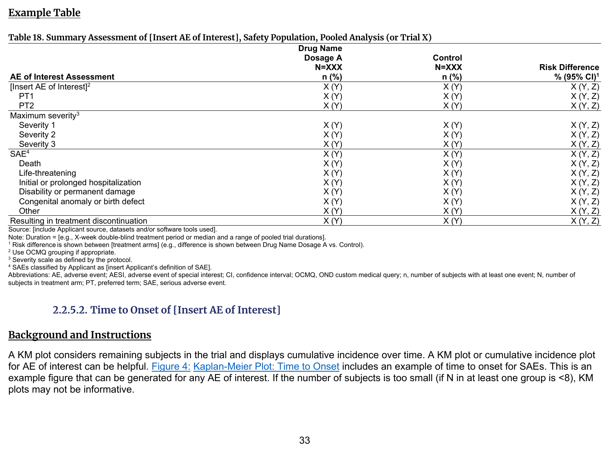
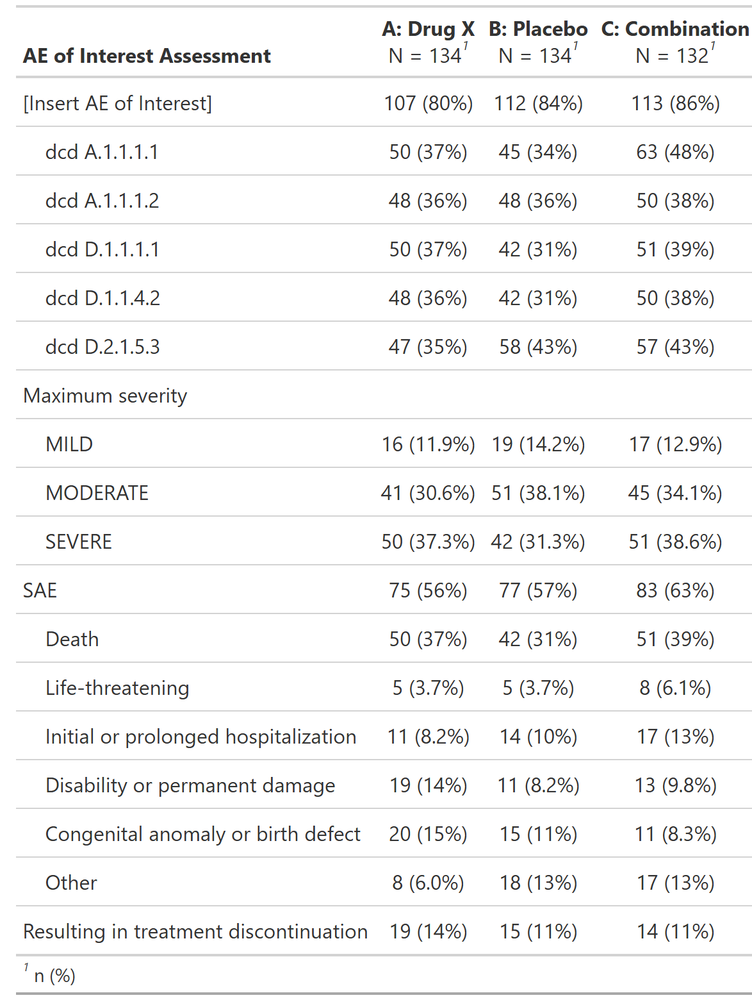

::::: columns

:::: {.column width="52%"}
### FDA IG Shell

{fig-alt="FDA IG example table shell" .lightbox width=100%}

### Programming Notes

**Background and Instructions**

Table 18: Summary Assessment of [Insert AE of Interest] is created for each AE of interest and may be created for any AEs identified during application review that may warrant further analysis. The table name should be updated to reflect the event being displayed. The approach to analysis and summary of safety data should be tailored to each AE.

**Customization**

Discuss with CDS specific AEs and other information (e.g., laboratory information) to be included in Table 18 to provide a complete picture of the AE of Interest. When information across different datasets is combined, carefully consider the number of subjects used as the denominator in analyses, as they may differ across datasets.

::::

:::: {.column width="4%"}
::::

:::: {.column width="44%"}
### Output

```{r out-result, echo=FALSE, fig.align='center', out.width='100%'}

```

::::

:::::

::: panel-tabset
## Full Code

```{r fullcode, file="../../../inst/templates/fda-table_18.R", message=FALSE, warning=FALSE, results='hide'}
```

## Table

```{r tbl}
tbl
```

## ARD

```{r ard, message=FALSE, warning=FALSE}
withr::local_options(width = 9999, tibble.print_max = Inf)
print(ard, columns = "all")
```

:::

