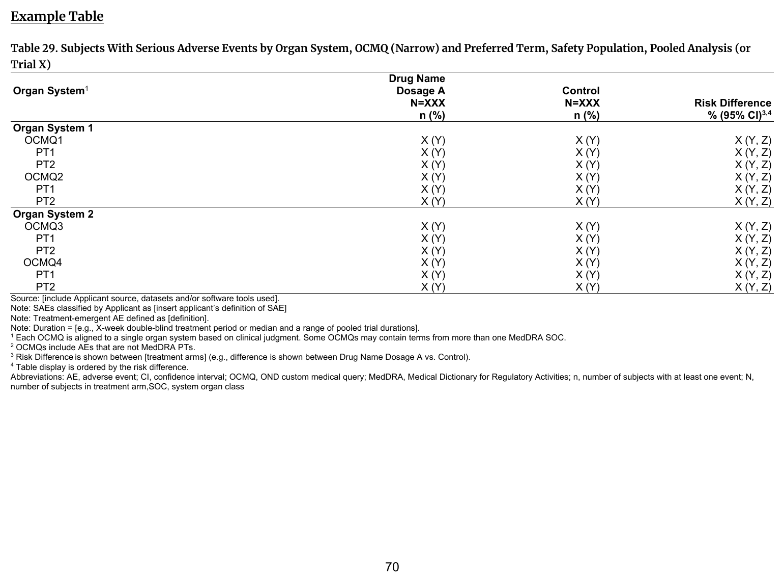
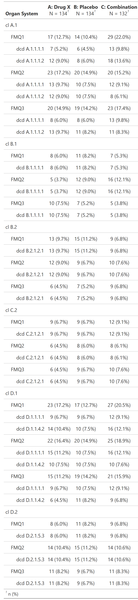

::::: columns

:::: {.column width="52%"}
### FDA IG Shell

{fig-alt="FDA IG example table shell" .lightbox width=100%}

### Programming Notes

**Background and Instructions**

Table 29: Subjects With Serious Adverse Events by Organ System presents preferred terms under each OCMQ listed in Table 11 Subjects With Serious Adverse Events by Organ System and OCMQ (Narrow), Safety Population, Pooled Analysis (or Trial X).

**Customization**

If deemed necessary, clinical reviewers may request CDS to add OCMQs (broad) to the table. Based on the assessment of the OCMQ results, clinical reviewers may request Table 41: Subjects With Select Narrow FDA Medical Queries from Section 4.1 Optional Adverse Event Analyses to explore the data for specific subjects.

::::

:::: {.column width="4%"}
::::

:::: {.column width="44%"}
### Output

```{r out-result, echo=FALSE, fig.align='center', out.width='100%'}

```

::::

:::::

::: panel-tabset
## Full Code

```{r fullcode, eval=FALSE}
# Load libraries & data -------------------------------------
library(dplyr)
library(cards)
library(gtsummary)

adae <- pharmaverseadam::adae
adsl <- pharmaverseadam::adsl

set.seed(1)
adae <- adae |>
  rename(OCMQ01SC = AEHLTCD) |>
  mutate(
    AESER = sample(c("Y", "N"), size = nrow(adae), replace = TRUE),
    OCMQ01NAM = sample(c("OCMQ1", "OCMQ2", "OCMQ3"), size = nrow(adae), replace = TRUE)
  ) |>
  # truncating table for demonstration
  filter(AESOC == "VASCULAR DISORDERS")
adae$OCMQ01SC[is.na(adae$OCMQ01SC)] <- "NARROW"

# Pre-processing --------------------------------------------
adsl <- adsl |>
  # safety population
  filter(
    SAFFL == "Y"
  )

data <- adae |>
  filter(
    # safety population
    SAFFL == "Y",
    # serious AEs
    AESER == "Y",
    # treatment-emergent
    TRTEMFL == "Y",
    # narrow OCMQ scope
    OCMQ01SC == "NARROW"
  )

ard <- ard_stack_hierarchical(
  data,
  variables = c(AEBODSYS, OCMQ01NAM, AEDECOD),
  by = TRT01A,
  id = USUBJID,
  denominator = adsl,
  # variables to include AE rates for
  include = c(OCMQ01NAM, AEDECOD)
)

# Print ARD
withr::local_options(width = 9999)
print(ard, columns = "all", n = 40)

# create table using ARD-first approach (ARD -> table)
tbl <-
  tbl_ard_hierarchical(
    ard,
    variables = c(AEBODSYS, OCMQ01NAM, AEDECOD),
    by = TRT01A,
    # variables to display AE rates for
    include = c(OCMQ01NAM, AEDECOD)
  ) |>
  # add custom variable label
  modify_header(label = "**Organ System**")
```

## Setup

```{r setup, message=FALSE}
# Load libraries & data -------------------------------------
library(dplyr)
library(cards)
library(gtsummary)

adae <- pharmaverseadam::adae
adsl <- pharmaverseadam::adsl

set.seed(1)
adae <- adae |>
  rename(OCMQ01SC = AEHLTCD) |>
  mutate(
    AESER = sample(c("Y", "N"), size = nrow(adae), replace = TRUE),
    OCMQ01NAM = sample(c("OCMQ1", "OCMQ2", "OCMQ3"), size = nrow(adae), replace = TRUE)
  ) |>
  # truncating table for demonstration
  filter(AESOC == "VASCULAR DISORDERS")
adae$OCMQ01SC[is.na(adae$OCMQ01SC)] <- "NARROW"

# Pre-processing --------------------------------------------
adsl <- adsl |>
  # safety population
  filter(
    SAFFL == "Y"
  )

data <- adae |>
  filter(
    # safety population
    SAFFL == "Y",
    # serious AEs
    AESER == "Y",
    # treatment-emergent
    TRTEMFL == "Y",
    # narrow OCMQ scope
    OCMQ01SC == "NARROW"
  )
```

## Build ARD

```{r ard, message=FALSE, warning=FALSE, results='hide'}
ard <- ard_stack_hierarchical(
  data,
  variables = c(AEBODSYS, OCMQ01NAM, AEDECOD),
  by = TRT01A,
  id = USUBJID,
  denominator = adsl,
  # variables to include AE rates for
  include = c(OCMQ01NAM, AEDECOD)
)

ard
```

```{r, echo=FALSE}
# Print ARD
withr::local_options(width = 9999)
print(ard, columns = "all", n = 40)
```

## Build Table

```{r tbl, results = 'hide'}
# create table using ARD-first approach (ARD -> table)
tbl <-
  tbl_ard_hierarchical(
    ard,
    variables = c(AEBODSYS, OCMQ01NAM, AEDECOD),
    by = TRT01A,
    # variables to display AE rates for
    include = c(OCMQ01NAM, AEDECOD)
  ) |>
  # add custom variable label
  modify_header(label = "**Organ System**")

tbl
```

:::
