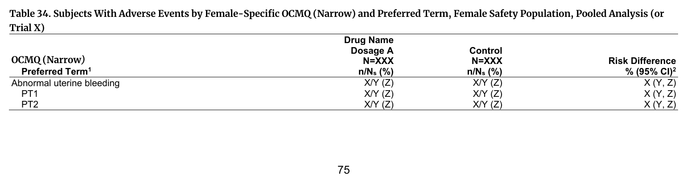
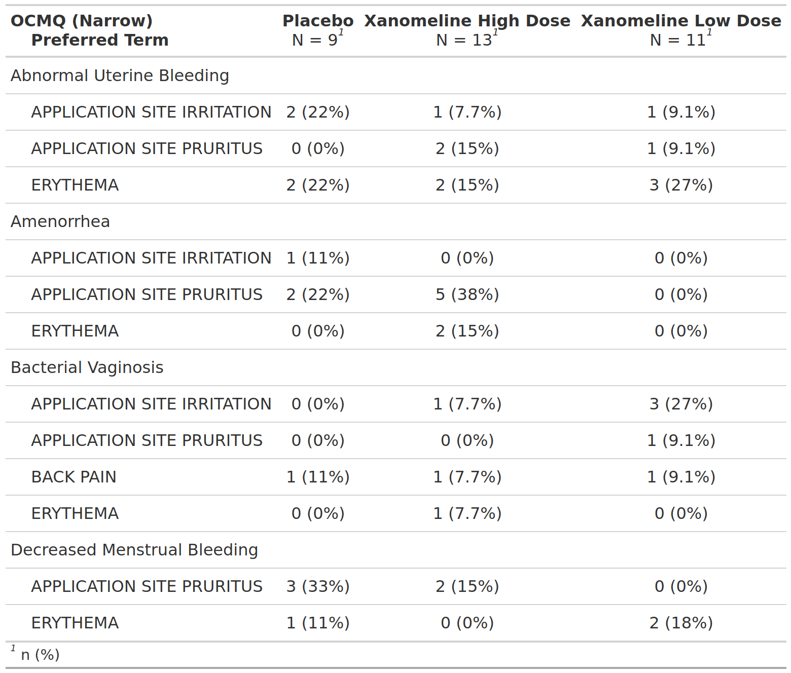

::::: columns

:::: {.column width="52%"}
### FDA IG Shell

{fig-alt="FDA IG example table shell" .lightbox width=100%}

### Programming Notes

**Background and Instructions**

Some OCMQs are relevant to only one sex. For instance, the Erectile Dysfunction OCMQ is relevant only to males, while the Abnormal Uterine Bleeding OCMQ is relevant only to females. Therefore, the tables that present these sex-specific OCMQs provide only the results for males or females, as appropriate, and have smaller denominators than the full safety population. Table 33: Adverse Events by Male Specific FDA Medical Query is limited to male-specific OCMQs and the male population. Table 34: Adverse Events by Female Specific FDA Medical Query is limited to female-specific OCMQs and the female population.

**Customization**

Clinical reviewers may request a similar table of AEs by male or female specific OCMQs (broad) from the CDS.

::::

:::: {.column width="4%"}
::::

:::: {.column width="44%"}
### Output

```{r out-result, echo=FALSE, fig.align='center', out.width='100%'}

```

::::

:::::

::: panel-tabset
## Full Code

```{r fullcode, eval=FALSE}
# Load libraries & data -------------------------------------
library(dplyr)
library(cards)
library(gtsummary)

adsl <- pharmaverseadam::adsl
adae <- pharmaverseadam::adae

set.seed(1)
adae <- adae |>
  mutate(
    OCMQ01SC = as.factor(sample(c("BROAD", "NARROW"), nrow(adae), replace = TRUE)),
    OCMQ01NAM = if_else(
      SEX == "F",
      as.factor(sample(
        c("Abnormal Uterine Bleeding", "Amenorrhea", "Bacterial Vaginosis", "Decreased Menstrual Bleeding"),
        n(),
        replace = TRUE
      )),
      NA_character_
    )
  )

# Pre-processing --------------------------------------------
data <- adae |>
  filter(
    SAFFL == "Y",
    SEX == "F",
    OCMQ01SC == "NARROW",
    # Filtering to reduce the size of the demo table
    AEDECOD %in% c("APPLICATION SITE IRRITATION", "ERYTHEMA", "APPLICATION SITE PRURITUS", "BACK PAIN")
  ) |>
  select(OCMQ01SC, TRT01A, OCMQ01NAM, AEDECOD, USUBJID) |>
  # setting an explicit level for NA values so empty strata combinations are shown.
  mutate(across(everything(), ~ {
    if (anyNA(.)) {
      forcats::fct_na_value_to_level(as.factor(.), level = "<Missing>")
    } else {
      .
    }
  }))

# denominator values include only Female subjects in the arm with AEs
denom <- data |> distinct(USUBJID, TRT01A)

tbl <- data |>
  tbl_hierarchical(
    by = TRT01A,
    variables = c(OCMQ01NAM, AEDECOD),
    id = USUBJID,
    denominator = denom,
    # variables to calculate rates for
    include = c(AEDECOD),
    label = list(
      OCMQ01NAM ~ "OCMQ (Narrow)",
      AEDECOD ~ "Preferred Term"
    )
  )

ard <- gather_ard(tbl)

# Print ARD
withr::local_options(width = 9999)
print(ard, columns = "all")
```

## Setup

```{r setup, message=FALSE}
# Load libraries & data -------------------------------------
library(dplyr)
library(cards)
library(gtsummary)

adsl <- pharmaverseadam::adsl
adae <- pharmaverseadam::adae

set.seed(1)
adae <- adae |>
  mutate(
    OCMQ01SC = as.factor(sample(c("BROAD", "NARROW"), nrow(adae), replace = TRUE)),
    OCMQ01NAM = if_else(
      SEX == "F",
      as.factor(sample(
        c("Abnormal Uterine Bleeding", "Amenorrhea", "Bacterial Vaginosis", "Decreased Menstrual Bleeding"),
        n(),
        replace = TRUE
      )),
      NA_character_
    )
  )

# Pre-processing --------------------------------------------
data <- adae |>
  filter(
    SAFFL == "Y",
    SEX == "F",
    OCMQ01SC == "NARROW",
    # Filtering to reduce the size of the demo table
    AEDECOD %in% c("APPLICATION SITE IRRITATION", "ERYTHEMA", "APPLICATION SITE PRURITUS", "BACK PAIN")
  ) |>
  select(OCMQ01SC, TRT01A, OCMQ01NAM, AEDECOD, USUBJID) |>
  # setting an explicit level for NA values so empty strata combinations are shown.
  mutate(across(everything(), ~ {
    if (anyNA(.)) {
      forcats::fct_na_value_to_level(as.factor(.), level = "<Missing>")
    } else {
      .
    }
  }))

# denominator values include only Female subjects in the arm with AEs
denom <- data |> distinct(USUBJID, TRT01A)
```

## Build Table

```{r tbl, results = 'hide'}
tbl <- data |>
  tbl_hierarchical(
    by = TRT01A,
    variables = c(OCMQ01NAM, AEDECOD),
    id = USUBJID,
    denominator = denom,
    # variables to calculate rates for
    include = c(AEDECOD),
    label = list(
      OCMQ01NAM ~ "OCMQ (Narrow)",
      AEDECOD ~ "Preferred Term"
    )
  )

tbl
```

## Build ARD

```{r ard, message=FALSE, warning=FALSE, results='hide'}
ard <- gather_ard(tbl)
ard
```

```{r, echo=FALSE}
# Print ARD
withr::local_options(width = 9999)
print(ard, columns = "all")
```

:::
