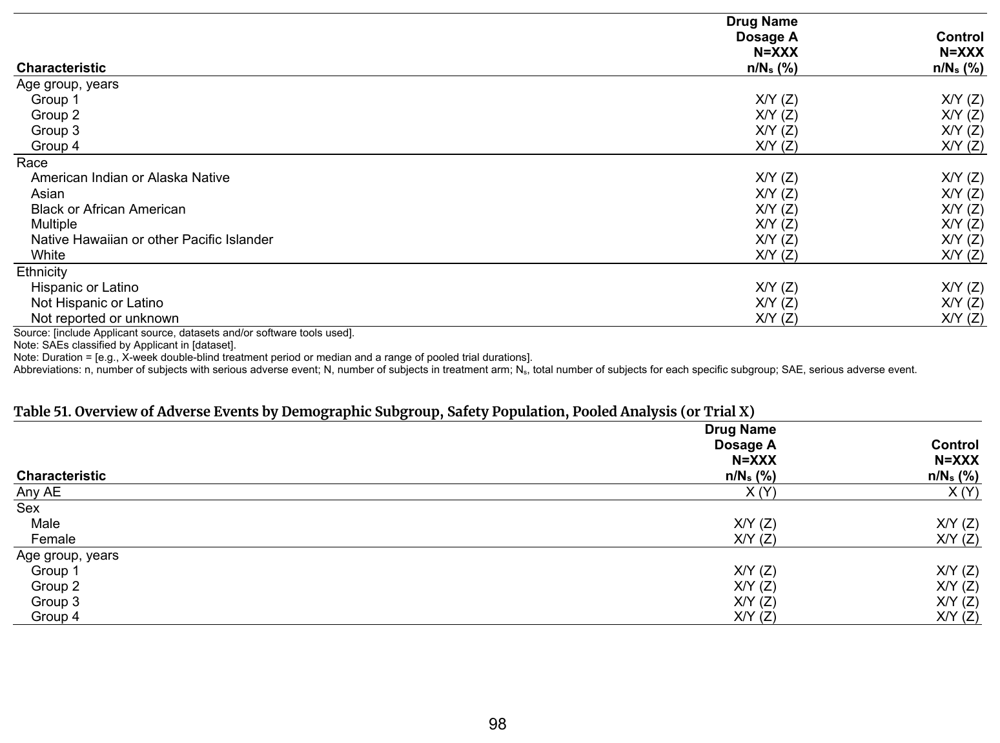
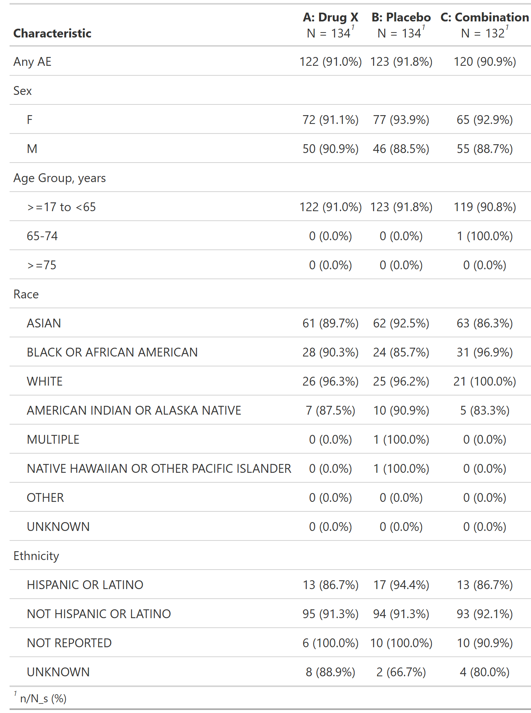

::::: columns

:::: {.column width="52%"}
### FDA IG Shell

{fig-alt="FDA IG example table shell" .lightbox width=100%}

### Programming Notes

**Background and Instructions**

Table 50: Overview of Serious Adverse Events by Demographic Subgroup and Table 51: Overview of Adverse Events by Demographic Subgroup in this section display placeholder values for the demographic characteristics for subgroup analysis of SAEs and AEs. These placeholder values will change to reflect the values found in the clinical trial data. When CDISC-controlled terminology is used in the clinical trial data, the demographic characteristics in this table will reflect the controlled terminology.

**Customization**

Provide any additional potentially relevant subgroups beyond the standard demographic ones that may shed light on which subjects are most susceptible to the safety event (e.g., baseline diseases [e.g., cardiovascular disease or diabetes, or by CKD stage], concomitant medication, anthropometric characteristics [e.g., BMI]). The clinical reviewer should discuss appropriate age groups for the subgroup analysis with the CDS.

::::

:::: {.column width="4%"}
::::

:::: {.column width="44%"}
### Output

```{r out-result, echo=FALSE, fig.align='center', out.width='100%'}

```

::::

:::::

::: panel-tabset
## Full Code

```{r fullcode, eval=FALSE}
# Load libraries & data -------------------------------------
library(dplyr)
library(cards)
library(gtsummary)

adae <- pharmaverseadam::adae
adsl <- pharmaverseadam::adsl

adsl <- adsl |>
  filter(SAFFL == "Y") |>
  mutate(any_ae = "Any AE")

data <- adae |>
  filter(
    SAFFL == "Y",
    TRTEMFL == "Y"
  ) |>
  mutate(any_ae = "Any AE") |>
  # subset to one AE per subject
  dplyr::slice_tail(n = 1L, by = all_of(c("USUBJID", "ARM")))

# generate ARD for `n` statistic
ard_summary <- data |>
  ard_categorical(
    variables = c(any_ae, SEX, AGEGR1, RACE, ETHNIC),
    by = ARM,
    statistic = ~"n"
  )

# generate ARD for `N_s` statistic
ard_Ns <- adsl |>
  ard_categorical(
    variables = c(any_ae, SEX, AGEGR1, RACE, ETHNIC),
    by = ARM,
    statistic = ~"n",
    stat_label = ~ list(n = "N_s")
  ) |>
  mutate(stat_name = "N_s")

# generate ARD for `p` statistic
ard_p <-
  cards::bind_ard(
    ard_summary,
    ard_Ns
  ) |>
  select(-stat_label) |>
  tidyr::pivot_wider(names_from = stat_name, values_from = stat, values_fn = unlist) |>
  rowwise() |>
  mutate(
    stat_name = "p",
    stat_label = "%",
    stat = if_else(n > 0, list(n / N_s), list(0)),
    fmt_fun = list(label_round(digits = 1, scale = 100))
  ) |>
  select(-n, -N_s)

# combine all ARDs
ard <- cards::bind_ard(ard_summary, ard_Ns, ard_p, ard_categorical(adsl, variables = ARM, statistic = ~"n")) |>
  cards::tidy_ard_row_order()

# generate table from ARDs
tbl <-
  tbl_ard_summary(
    ard,
    by = ARM,
    # set variable labels
    label = list(
      SEX = "Sex",
      AGEGR1 = "Age Group, years",
      RACE = "Race",
      ETHNIC = "Ethnicity"
    )
  ) |>
  gtsummary::modify_table_body(
    \(x) x |> filter(!label %in% "any_ae")
  ) |>
  gtsummary::modify_indent(columns = label, rows = variable == "any_ae", indent = 0L) |>
  # update statistic footnote
  gtsummary::modify_footnote_header(
    footnote = "n/N_s (%)",
    columns = all_stat_cols()
  ) |>
  gtsummary::modify_header(all_stat_cols() ~ "**{level}**  \n N = {n}")

ard <- gather_ard(tbl)

# Print ARD
withr::local_options(width = 9999)
print(ard, columns = "all", n = 40, na.print = NULL)
```

## Setup

```{r setup, message=FALSE}
# Load libraries & data -------------------------------------
library(dplyr)
library(cards)
library(gtsummary)

adae <- pharmaverseadam::adae
adsl <- pharmaverseadam::adsl

adsl <- adsl |>
  filter(SAFFL == "Y") |>
  mutate(any_ae = "Any AE")

data <- adae |>
  filter(
    SAFFL == "Y",
    TRTEMFL == "Y"
  ) |>
  mutate(any_ae = "Any AE") |>
  # subset to one AE per subject
  dplyr::slice_tail(n = 1L, by = all_of(c("USUBJID", "ARM")))
```

## Build Table

```{r tbl, message=FALSE, warning=FALSE}
# generate ARD for `n` statistic
ard_summary <- data |>
  ard_categorical(
    variables = c(any_ae, SEX, AGEGR1, RACE, ETHNIC),
    by = ARM,
    statistic = ~"n"
  )

# generate ARD for `N_s` statistic
ard_Ns <- adsl |>
  ard_categorical(
    variables = c(any_ae, SEX, AGEGR1, RACE, ETHNIC),
    by = ARM,
    statistic = ~"n",
    stat_label = ~ list(n = "N_s")
  ) |>
  mutate(stat_name = "N_s")

# generate ARD for `p` statistic
ard_p <-
  cards::bind_ard(
    ard_summary,
    ard_Ns
  ) |>
  select(-stat_label) |>
  tidyr::pivot_wider(names_from = stat_name, values_from = stat, values_fn = unlist) |>
  rowwise() |>
  mutate(
    stat_name = "p",
    stat_label = "%",
    stat = if_else(n > 0, list(n / N_s), list(0)),
    fmt_fun = list(label_round(digits = 1, scale = 100))
  ) |>
  select(-n, -N_s)

# combine all ARDs
ard <- cards::bind_ard(ard_summary, ard_Ns, ard_p, ard_categorical(adsl, variables = ARM, statistic = ~"n")) |>
  cards::tidy_ard_row_order()

# generate table from ARDs
tbl <-
  tbl_ard_summary(
    ard,
    by = ARM,
    # set variable labels
    label = list(
      SEX = "Sex",
      AGEGR1 = "Age Group, years",
      RACE = "Race",
      ETHNIC = "Ethnicity"
    )
  ) |>
  gtsummary::modify_table_body(
    \(x) x |> filter(!label %in% "any_ae")
  ) |>
  gtsummary::modify_indent(columns = label, rows = variable == "any_ae", indent = 0L) |>
  # update statistic footnote
  gtsummary::modify_footnote_header(
    footnote = "n/N_s (%)",
    columns = all_stat_cols()
  ) |>
  gtsummary::modify_header(all_stat_cols() ~ "**{level}**  \n N = {n}")

tbl
```

## Build ARD

```{r ard, message=FALSE, warning=FALSE, results='hide'}
ard <- gather_ard(tbl)

ard
```

```{r, echo=FALSE}
# Print ARD
withr::local_options(width = 9999)
print(ard, columns = "all", n = 40, na.print = NULL)
```

:::
